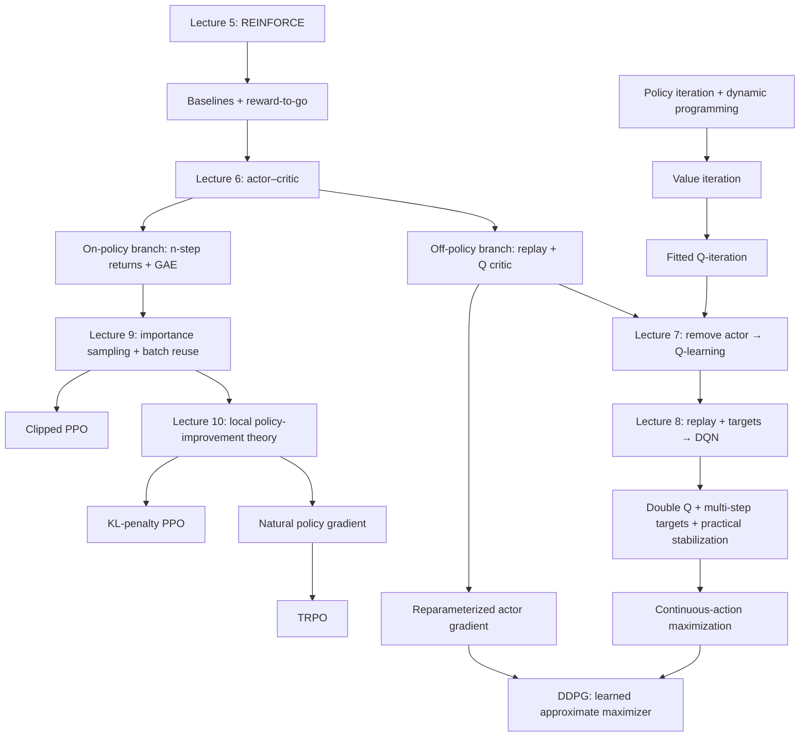

# Lectures 5–10: a connected guide to policy gradients, actor–critic, Q-learning, and policy optimization

This guide synthesizes the supplied CS 185/285 Spring 2026 lecture notes, the original slide PDFs, and a direct cross-check of the raw lecture transcripts. It is organized around the problem each idea solves, the assumptions it changes, and the cost of that change. The purpose is to connect the algorithms into a coherent system rather than memorize six independent lectures.

**Reading routes:** [the algorithm map](#1-the-structure-behind-all-six-lectures) · [common notation](#2-common-notation-and-assumptions) · [lecture 5](#3-lecture-5-policy-gradients-and-reinforce) · [lecture 6](#4-lecture-6-actorcritic-and-advantage-estimation) · [lecture 7](#5-lecture-7-value-based-rl-policy-iteration-and-fitted-q-iteration) · [lecture 8](#6-lecture-8-making-deep-q-learning-work-in-practice) · [lecture 9](#7-lecture-9-importance-sampling-batch-reuse-and-clipped-ppo) · [lecture 10](#8-lecture-10-why-local-policy-improvement-works-and-how-to-control-it) · [cross-connections](#9-connections-to-keep-explicit-while-studying) · [worked examples](#10-worked-examples-that-connect-the-formulas) · [algorithm comparison](#11-a-practical-comparison-of-the-major-algorithms) · [parameter meanings](#12-parameters-what-each-one-actually-controls) · [source qualifications](#13-precision-notes-and-limits-of-source-coverage) · [topic-to-source index](#14-topic-to-source-map-for-a-second-reading).

For each substantial algorithm, the discussion gives its steps, intuition, assumptions and appropriate situations, consequences, and limitations. Supporting derivations and implementation details are included because they explain why the algorithms work or fail. Administrative announcements, breaks, and classroom setup are omitted; the technical material and relevant practical advice are retained.

## Sources and reading conventions

| Lecture | Notes | Original slides | Transcript | PDF pages checked |
|---|---|---|---|---:|
| 5: Policy Gradients | [Lecture 5 notes](lecture_05_policy_gradients.md) | [Lecture 5 PDF](../lectures/Lecture%2005%20-%20Policy%20Gradients.pdf) | [Lecture 5 transcript](../transcripts/CS%20185285%20%28Spring%202026%29%20Lecture%205,%20Policy%20Gradients.txt) | 23 |
| 6: Actor–Critic | [Lecture 6 notes](lecture_06_actor_critic.md) | [Lecture 6 PDF](../lectures/Lecture%2006%20-%20Actor%20Critic.pdf) | [Lecture 6 transcript](../transcripts/CS%20185285%20%28Spring%202026%29%20Lecture%206,%20Actor-Critic.txt) | 33 |
| 7: Value-Based RL | [Lecture 7 notes](lecture_07_value_based_rl.md) | [Lecture 7 PDF](../lectures/Lecture%2007%20-%20Value-Based%20RL.pdf) | [Lecture 7 transcript](../transcripts/CS%20185285%20%28Spring%202026%29%20Lecture%207,%20Value-Based%20RL.txt) | 20 |
| 8: Q-Learning in Practice | [Lecture 8 notes](lecture_08_q_learning_in_practice.md) | [Lecture 8 PDF](../lectures/Lecture%2008%20-%20Q-Learning%20in%20Practice.pdf) | [Lecture 8 transcript](../transcripts/CS%20185285%20%28Spring%202026%29%20Lecture%208,%20Q-Learning%20in%20Practice.txt) | 36 |
| 9: Advanced Policy Gradients, Part 1 | [Lecture 9 notes](lecture_09_advanced_policy_gradients_part_1.md) | [Lecture 9 PDF](../lectures/Lecture%2009%20-%20Advanced%20Policy%20Gradients%20Part%201.pdf) | [Lecture 9 transcript](../transcripts/CS%20185285%20%28Spring%202026%29%20Lecture%209,%20Off-Policy%20Policy%20Gradient.txt) | 16 |
| 10: Advanced Policy Gradients, Part 2 | [Lecture 10 notes](lecture_10_advanced_policy_gradients_part_2.md) | [Lecture 10 PDF](../lectures/Lecture%2010%20-%20Advanced%20Policy%20Gradients%20Part%202.pdf) | [Lecture 10 transcript](../transcripts/CS%20185285%20%28Spring%202026%29%20Lecture%2010,%20Advanced%20Policy%20Gradient.txt) | 33 |

All **161 original PDF pages** were extracted and visually inspected. Many equations in the PDFs are embedded graphics, so text extraction alone was insufficient. Page references below use the actual supplied PDF page numbers, counting the title page as page 1. Some page references in the existing lecture notes differ from those PDFs; this guide uses the verified numbers. The raw transcripts were cross-checked for spoken derivations, examples, implementation advice, and audience questions that do not appear fully on the slides; administrative discussion and transcription noise remain omitted.

The notes already separate transcript content, slide reconciliation, and additional explanation. This guide integrates their technical content, while identifying mathematical corrections and additional connective explanation explicitly. Lecture 8's supplied transcript ends during a final audience question; its slides are available, but the missing spoken answer cannot be recovered.

## 1. The structure behind all six lectures

Every algorithm repeatedly addresses three questions:

1. **Sampling:** How do we obtain experience, and which policy generates it?
2. **Evaluation:** How do we estimate the consequences of decisions?
3. **Improvement:** How do we change decisions to obtain more reward?

The lectures change one or more of these components while retaining the same overall loop.

| Starting point | Difficulty | New idea | What is gained | What must now be managed |
|---|---|---|---|---|
| Directly differentiating rollout reward | The environment is an unknown or nondifferentiable black box | Likelihood-ratio policy gradient | A gradient without a dynamics derivative | High sampling variance |
| Full-trajectory REINFORCE | Lucky starts and unrelated rewards obscure action quality | Baselines and reward-to-go | A cleaner gradient estimate | Variance is still substantial |
| One sampled future per action | A single future is noisy | Learn a value or Q critic | Generalization can average many futures | Approximation error |
| Full Monte Carlo returns | Long trajectories have noisy returns and delayed updates | Bootstrapping, n-step returns, GAE | Adjustable bias–variance trade-off | Incorrect critics can bias updates |
| Discarding old experience | Environment interaction is expensive | Replay and off-policy Q evaluation | Greater sample reuse | State coverage, critic error, and stale data |
| Explicitly learning an actor | Discrete actions can be enumerated | Greedy action selection from Q | Remove actor optimization | Reliable Q-learning becomes central |
| Neural Q-learning | Self-generated targets change during regression | Target networks and replay | Better practical stability | Target lag and update schedules |
| Maximizing noisy Q estimates | The maximum selects positive errors | Double Q and clipped double Q | Reduce optimism or add conservatism | Residual correlation or underestimation |
| Discrete-action Q-learning | Continuous actions cannot be enumerated | Numerical search or a learned maximizer | Continuous control | Approximate maximization and critic exploitation |
| One policy-gradient update per batch | Data collection is wasteful | Importance sampling and a local surrogate | Multiple updates per batch | Ratio variance and state-distribution drift |
| Unconstrained batch reuse | The candidate policy can leave the region represented by the batch | PPO, KL penalties, natural gradient, TRPO | Controlled local policy improvement | Approximate constraints and finite-sample estimates |

These branches address different bottlenecks. Actor–critic is not automatically superior to REINFORCE, Q-learning is not automatically superior to actor–critic, and PPO is not an unrestricted replay-buffer algorithm. Each trades one difficulty for another.

## 2. Common notation and assumptions

Let a transition be $(s_t, a_t, r_t, s_{t+1})$. The environment has initial distribution $p_0(s)$ and transition distribution $p(s' \mid s,a)$. The actor is a policy $\pi_\theta(a \mid s)$. Critic parameters are $\phi$. A bar, such as $Q_{\bar\phi}$, denotes a frozen or slowly updated reference network.

The notation separates objects with different roles in an update. The policy parameters $\theta$ are the variables being optimized by an actor step. Critic parameters $\phi$ are optimized by a distinct prediction loss. A sampled transition is data: once it has been collected, its four entries are fixed numbers during that optimizer step. A target network or old policy is also held fixed while it supplies labels, likelihood ratios, or a local reference. This separation matters because allowing automatic differentiation through a quantity that is supposed to be fixed generally implements a different estimator.

For a finite episode ending after H decisions, define the return from time t by

$$
G_t=\sum_{k=0}^{H-1-t}\gamma^k r_{t+k}.
$$

Lecture 5 initially uses the undiscounted finite-horizon case, $\gamma = 1$. Discounting is introduced in lecture 6. For a continuing discounted task,

$$
J(\pi)=\mathbb E_\pi\!\left[\sum_{t=0}^{\infty}\gamma^t r_t\right],
\qquad 0\leq\gamma<1.
$$

The central functions are

$$
Q^\pi(s,a)=\mathbb E_\pi[G_t\mid s_t=s,a_t=a],
$$

$$
V^\pi(s)=\mathbb E_{a\sim\pi(\cdot\mid s)}[Q^\pi(s,a)],
\qquad
A^\pi(s,a)=Q^\pi(s,a)-V^\pi(s).
$$

**Q:** take this first action, then follow $\pi$. **V:** follow $\pi$ starting now, including its first action. **Advantage:** how much better this action is than $\pi$'s average action in this state.

Each definition is a conditional expectation, so it specifies what is fixed and what remains random. In $Q^\pi(s,a)$, the current state and first action are fixed; future transitions and future policy actions are averaged. In $V^\pi(s)$, only the current state is fixed, so the first action is also averaged under $\pi$. Their difference therefore isolates the consequence of choosing $a$ instead of drawing the policy's ordinary action at that same state. It is not the difference between the action's realized reward and the average immediate reward.

The superscript matters: $Q^\pi$ evaluates a particular policy; $Q^*$ evaluates optimal continuation. A neural network called Q is not automatically either one accurately. In a genuine finite-horizon task, the remaining time matters: write $V_t^\pi, Q_t^\pi$, or include time in the state. A stationary value network implicitly assumes the state contains everything relevant to future return.

The exact discounted policy-gradient theorem can be written using normalized discounted occupancy

$$
d^\pi(s)=(1-\gamma)\sum_{t=0}^\infty\gamma^t\Pr_\pi(s_t=s)
$$

as

$$
\nabla_\theta J(\theta)
=\frac{1}{1-\gamma}\mathbb E_{s\sim d^\pi,a\sim\pi}
[\nabla_\theta\log\pi_\theta(a\mid s)Q^\pi(s,a)].
$$

The constant can be absorbed into the step size. With ordinary complete trajectories, the corresponding expression contains an outer $\gamma^t$. The lecture algorithms often suppress this weighting in their transition notation. **Precision point:** uniformly averaging rollout transitions is not literally identical to sampling the exact discounted occupancy. This guide distinguishes exact identities from the practical surrogates used in implementations.

The environment and reward mechanism are assumed independent of $\theta$. Rewards need to be observed; they need not be differentiable or available as a callable formula. The dog-training example in lecture 6 illustrates that distinction.

## 3. Lecture 5: policy gradients and REINFORCE

**Source:** lecture 5 notes §§2–14; original PDF pp. 3–23. The gradient derivation is on pp. 5–7, baseline and causality on pp. 17–18, and implementation on pp. 20–23.

### 3.1 Why directly backpropagating observed reward is insufficient

After a trajectory has been sampled, each observed reward is just a fixed number. Differentiating that number does not answer the learning question. The desired quantity is $\nabla_\theta J(\theta)$: how the **expected** return would change if the policy parameters changed and thereby changed the distribution of future trajectories. The derivative acts on the distribution that produces the data, not retrospectively on the numerical reward already observed.

To see the missing path, suppose the environment were deterministic, $s_{t+1}=f(s_t,a_t)$, and the policy produced $a_t=\mu_\theta(s_t)$. A pathwise derivative of a later reward contains terms such as

$$
\frac{\partial r_{t+1}}{\partial s_{t+1}}
\frac{\partial f(s_t,a_t)}{\partial a_t}
\frac{\partial \mu_\theta(s_t)}{\partial\theta}.
$$

Differentiating only the immediate reward $r(s_t,a_t)$ can recover a direct term through $a_t$, but it omits the derivative through $f$ and hence the effect of $a_t$ on every later state and reward. In a stochastic environment the analogous computation must also differentiate through an appropriate representation of the random draws. A physical environment or an ordinary simulator returns samples of those transitions, not the Jacobian or differentiable sampling program required by this chain rule.

Action sampling creates the same issue at the policy boundary. A categorical action is a discrete draw, so the sampled action is not an ordinary differentiable function of the logits. Even when the policy distribution is differentiable in $\theta$, the particular sampled action does not provide a pathwise derivative by itself.

Two estimator families arise:

- **Pathwise derivative:** rewrite all relevant random variables as differentiable transformations of parameter-independent noise, then apply the chain rule through the sampled computation. This estimates how the sampled outcome changes as $\theta$ changes. It requires a suitable differentiable environment or, later in lecture 6, a differentiable learned critic for the part through which the derivative is taken.
- **Likelihood-ratio or score-function estimator:** leave the sampled outcome fixed and differentiate its log probability. This estimates how changing $\theta$ changes how often such outcomes occur. It does not require differentiating the environment's transition function.

These are two solutions to the same derivative problem. The second gives the first model-free policy-gradient algorithm because a rollout supplies rewards and the policy supplies differentiable action log probabilities, even when the transition mechanism is opaque. A differentiable simulator can permit the first, but the lecturer postpones its numerical difficulties to model-based RL.

### 3.2 The log-derivative trick and cancellation of dynamics

For $R(\tau)=\sum_t r_t$, trajectory probability factorizes as

$$
p_\theta(\tau)=p_0(s_0)\prod_{t=0}^{H-1}
\pi_\theta(a_t\mid s_t)p(s_{t+1}\mid s_t,a_t).
$$

Use the identity

$$
\nabla_\theta p_\theta(\tau)
=p_\theta(\tau)\nabla_\theta\log p_\theta(\tau).
$$

The identity converts a derivative of a probability density into the density times a derivative that can be evaluated at sampled trajectories. Starting from $J(\theta)=\int p_\theta(\tau)R(\tau)d\tau$, the reward $R(\tau)$ is held fixed when differentiating the density assigned to that particular trajectory. Multiplying and dividing by $p_\theta(\tau)$ then turns the integral back into an expectation under the current policy. That is what makes Monte Carlo estimation possible: trajectories already arrive with frequency $p_\theta(\tau)$, so the estimator need not know their complete environment likelihood.

Then

$$
\nabla_\theta J
=\mathbb E_{\tau\sim p_\theta}
[R(\tau)\nabla_\theta\log p_\theta(\tau)].
$$

Taking logs turns the trajectory product into a sum. The initial-state and transition terms do not disappear because they are numerically equal to one or because the environment is deterministic. They disappear from the **derivative** because, under the model-free policy-gradient assumption, $p_0$ and $p(s'\mid s,a)$ contain no policy parameter $\theta$. Their sampled values still determine which states and rewards appear in the trajectory. Differentiating the log factorization therefore leaves

$$
\nabla_\theta\log p_\theta(\tau)
=\sum_t\nabla_\theta\log\pi_\theta(a_t\mid s_t).
$$

Therefore, in lecture 5's undiscounted setting,

$$
\nabla_\theta J
=\mathbb E_\pi\!\left[
\left(\sum_t\nabla_\theta\log\pi_\theta(a_t\mid s_t)\right)R(\tau)
\right].
$$

**Intuition:** compare how probable each observed trial is under the policy with how good its outcome was. The environment still affects which trajectories occur and what rewards they contain; its derivative is unnecessary.

More precisely, $\nabla_\theta\log\pi_\theta(a_t\mid s_t)$ is the local direction that would increase the log probability of the sampled action. Multiplying it by return turns that direction into credit or blame. Averaging over trajectories is essential: a single term describes how to change the probability of one sampled decision, while the expectation recovers the derivative of the distribution-wide objective.

**Assumptions:** a differentiable stochastic policy with well-defined log probabilities, suitable regularity for differentiating the expectation, policy-independent environment dynamics, and samples from the policy being evaluated. The transcript's suggestion that linearity alone always permits exchanging a derivative and integral is too broad; regularity conditions are needed.

### 3.3 Basic REINFORCE: algorithm and interpretation

1. Run the current policy to collect N complete trajectories.
2. Compute each trajectory's total return $R_i$.
3. Estimate

$$
\hat g=\frac1N\sum_i R_i\sum_t
\nabla_\theta\log\pi_\theta(a_t^{(i)}\mid s_t^{(i)}).
$$

This sample average estimates the expectation in the policy-gradient identity. It does not estimate $J$ and then numerically differentiate that estimate; it estimates $\nabla_\theta J$ directly. Within one actor update, the trajectories and returns are data and are held fixed, while the log probabilities are differentiated with respect to the current policy parameters.

4. Take an ascent step $\theta\leftarrow\theta+\alpha\hat{g}$.
5. Collect new trajectories using the updated policy and repeat.

This resembles behavioral cloning. Maximum likelihood increases the probability of every demonstrated action. REINFORCE weights the same log-probability gradient by observed return. Positive weights reinforce sampled behavior; negative weights discourage it.

For categorical actions, the policy network produces logits and a softmax distribution. For Gaussian actions, it produces a mean and possibly a scale. With fixed covariance $\Sigma$,

$$
\nabla_\theta\log\pi_\theta(a\mid s)
=\left(\frac{\partial\mu_\theta(s)}{\partial\theta}\right)^\top
\Sigma^{-1}(a-\mu_\theta(s)).
$$

Thus a successful sampled action pulls the mean toward itself, with sensitivity determined by covariance. If scale is learned, it has additional score terms.

**When useful:** a simple baseline algorithm; discrete or continuous stochastic decisions; environments without differentiable dynamics; settings where rollouts are reasonably available and a critic is unnecessary or unreliable.

**Consequences:** the population gradient estimate is unbiased under the assumptions. It directly addresses expected return rather than a Bellman fixed point. A noisy gradient step does not guarantee that every finite-sample update improves realized performance.

**Limitations:** high variance, costly full episodes, weak finite-sample credit assignment, sensitivity to batch size and reward scale, and little immediate data reuse. It finds local improvements in the chosen policy class, not a general guarantee of global optimality.

### 3.4 Why variance is the main difficulty

In preset-position chess, some games begin from easy positions and others from nearly lost ones. A win can follow mediocre play, and a loss can follow excellent play. A good opening can be followed by a later blunder. An opponent can randomly rescue a bad move.

The basic update assigns the same total-return multiplier to all decisions in that game. Across repeated rollouts, a component of return that is independent of a decision's score has zero score-weighted expectation, and the full likelihood-ratio identity averages the remaining environment randomness correctly. That is the sense in which irrelevant luck does not create population bias; no pairwise numerical cancellation occurs inside one trajectory or one batch. The useful correlation between a particular score and later return can therefore be tiny relative to finite-sample noise. **Unbiasedness describes the average of repeated estimates; low variance describes the reliability of an individual practical estimate.**

Shorter trajectories can reduce uncertainty, but truncating away the only terminal reward removes the signal. The next ideas reduce noise while retaining the relevant outcomes.

### 3.5 Baselines: compare with the current standard

Replace R with $R - b$. For a fixed action-independent baseline,

$$
\mathbb E_\pi[b\nabla_\theta\log p_\theta(\tau)]
=b\nabla_\theta\int p_\theta(\tau)d\tau=0.
$$

The expected gradient is unchanged. The finite-sample update now compares a trial with the current policy's standard instead of an arbitrary absolute reward zero.

The zero follows in three steps. First, $b$ can be pulled outside the expectation because it is fixed with respect to the sampled trajectory in this argument. Second, the score identity converts $p_\theta(\tau)\nabla_\theta\log p_\theta(\tau)$ into $\nabla_\theta p_\theta(\tau)$. Third, integrating that derivative differentiates the total probability mass, which is always one. “Unbiased” therefore means that repeated baseline-adjusted gradient estimates have the same expectation as repeated unadjusted estimates. It does not mean that a particular mini-batch update is unchanged or closer to the true gradient.

**Steps:** estimate a baseline, subtract it from the return weight, hold it fixed during the actor derivative, and apply the same REINFORCE update. A current-policy mean return is a convenient practical baseline. After reward-to-go is introduced, a time-specific mean remaining return $b_t$ is more appropriate than one episode-total mean.

**Intuition:** a trader should reinforce a trial that beat its current normal performance. As the trader improves, that normal performance should rise. The baseline is not a permanently fixed reward shift.

**Assumptions and limitations:** the zero-expectation argument requires independence from the sampled action conditional on the information used by the score. A baseline can be a poor value predictor and still satisfy this identity. A bad baseline may fail to reduce variance; the mean return is not the exact variance-minimizing choice.

For a scalar trajectory baseline, with $z=\nabla_\theta\log p_\theta(\tau)$, the variance-minimizing baseline is

$$
b^*=\frac{\mathbb E[R\|z\|^2]}{\mathbb E[\|z\|^2]},
$$

which need not equal $\mathbb{E}[R]$. The analogous state baseline weights Q by the squared policy-score norm. This explains the lecturer's warning about the mean not being theoretically optimal.

**Finite-sample qualification:** a batch mean containing a trajectory's own return is statistically dependent on that trajectory. For independent trajectories with the full-trajectory estimator, subtracting that self-including mean scales the expected estimate by $(1 - 1/N)$. A separately estimated or leave-one-out baseline avoids this particular bias. Same-batch baselines are nevertheless common. The fixed-baseline proof should not be interpreted as proving exact unbiasedness of every data-dependent implementation.

Adding a constant to every reward leaves preferences unchanged in a fixed-horizon task, and in a continuing discounted task with the same constant stream for every policy. With variable episode lengths, a per-step reward shift can change preferences for longer versus shorter episodes. The chess illustration concerns removing irrelevant offsets, not an unrestricted reward-invariance theorem.

### 3.6 Reward-to-go: remove rewards the action could not cause

At time t, the action cannot change rewards obtained before t. Those past rewards have zero expected contribution when multiplied by the time-t score. Replace full R by

$$
G_t=\sum_{u=t}^{H-1}r_u
$$

The relevant argument conditions on everything available before $a_t$ is drawn. A past reward $r_u$ with $u<t$ is then fixed, while the conditional expectation of the score is zero:

$$
\mathbb E_{a_t\sim\pi_\theta(\cdot\mid s_t)}
[\nabla_\theta\log\pi_\theta(a_t\mid s_t)]=0.
$$

Multiplying this zero-mean score by a quantity already determined before $a_t$ cannot change its expectation. Future rewards cannot be removed in the same way because their distribution depends on $a_t$ through subsequent states and actions. Reward-to-go is therefore a causal deletion of irrelevant terms, not an assumption that only the immediate reward matters.

In the undiscounted lecture-5 estimator:

$$
\hat g=\frac1N\sum_{i,t}
\nabla_\theta\log\pi_\theta(a_t^{(i)}\mid s_t^{(i)})
(G_t^{(i)}-b_t).
$$

**Steps:** compute backward cumulative reward sums; assign each action its own remaining-return weight; subtract an appropriate baseline; apply the policy update.

**Intuition:** yesterday's success should not add noise to an update about today's decision. This is a causal credit-assignment improvement, without learning a critic.

**Consequences and limits:** removing these irrelevant terms preserves the expectation and generally produces a more useful estimator. Reward-to-go still includes lucky future events and later blunders. It does not identify the unique causal contribution of each action in an individual rollout.

### 3.7 The practical pseudo-loss

For a descent-based optimizer, use

$$
L_{\rm actor}(\theta)
=-\frac1N\sum_{i,t}\operatorname{stopgrad}(\hat A_t^{(i)})
\log\pi_\theta(a_t^{(i)}\mid s_t^{(i)}).
$$

Here $\hat{A}=G-\text{baseline}$. Sampled actions, states, and return weights are held fixed. Differentiating this expression gives the negative of the intended policy-gradient estimate.

Holding $\hat A_t$ fixed is part of the estimator definition. In an implementation this is a stop-gradient or detach operation. If $\hat A_t$ was produced by a critic and the actor loss were allowed to differentiate through it, the resulting derivative would include how the critic's prediction changes with $\theta$; that additional term is absent from the likelihood-ratio derivation. The actor and critic may share parameters operationally, but their loss terms still represent different mathematical derivatives.

It is a **pseudo-loss** because its scalar value on a fixed batch is not the original expected-return objective. Its role is to construct the desired derivative. Improving its number by repeatedly optimizing an old batch is not yet a valid RL algorithm; lecture 9 addresses that problem.

The main change from supervised action prediction is a per-example return weight. Use log probabilities or negative log likelihoods consistently with the optimizer sign. Detach weights so autograd does not introduce an unintended derivative through the critic or return calculation.

**Practical advice from the lecture:** use larger batches than in ordinary supervised learning, tune learning rates carefully, allow for noisy gradients, and consider an adaptive optimizer such as Adam. A correct likelihood-ratio derivation does not eliminate numerical tuning.

### 3.8 Partial observability

The derivation survives when the policy receives observations or histories instead of Markov states. Observation and environment probabilities still have no direct $\theta$ score. Replace $\pi(a \mid s)$ with $\pi(a \mid o)$ or a history-dependent policy and use the same estimator.

The reason is that the score-function derivation factorizes the probability of the **observed trajectory**, whatever variables are needed to describe it. All policy-dependent factors remain action probabilities; observation and transition factors remain environment terms. The Markov property is needed for compact Bellman functions of the current state, but it is not needed to write a likelihood ratio for the whole history.

This is a statement about gradient validity. A memoryless observation policy may be incapable of optimal behavior if the observation omits relevant information; memory or a recurrent policy can be necessary. Later Bellman evaluation arguments require a Markov state or a suitable sufficient representation more directly than the trajectory score argument does.

## 4. Lecture 6: actor–critic and advantage estimation

**Source:** lecture 6 notes §§1–21; original PDF pp. 3–18 and 21–33. GAE is on pp. 23–25; replay-based actor–critic and reparameterization are on pp. 27–33.

### 4.1 Replace a sampled future with its conditional expectation

Given $(s_t,a_t)$, the realized $G_t$ still depends on random next states and future actions. The true $Q^\pi(s_t,a_t)$ averages those possible futures.

Thus $G_t$ and $Q^\pi(s_t,a_t)$ refer to the same future-return quantity at different levels of averaging. $G_t$ is one sampled label. $Q^\pi$ is the conditional mean of all labels that could follow the same state and first action while policy $\pi$ controls the rest. The actor gradient needs that conditional mean in expectation; the Monte Carlo return is merely one unbiased way to estimate it.

Replacing G by exact Q preserves the gradient expectation because the policy score is already fixed conditional on $(s,a)$. This is a conditional-averaging or Rao–Blackwellization argument: average the irrelevant future randomness before using the weight.

Formally, apply iterated expectation to a score term $z_tG_t$, where $z_t=\nabla_\theta\log\pi_\theta(a_t\mid s_t)$:

$$
\mathbb E[z_tG_t]
=\mathbb E\!\left[z_t\,\mathbb E[G_t\mid s_t,a_t]\right]
=\mathbb E[z_tQ^\pi(s_t,a_t)].
$$

The inner expectation removes future transition and action noise while leaving the already sampled $(s_t,a_t)$ untouched. An exact Q-function would therefore reduce this source of variance without changing the target gradient. A learned critic approximates that conditional mean and introduces approximation error in exchange.

In the chess example, Q asks how the move would perform across many possible continuations, rather than judging it by one unlucky completion. Repeatedly resetting to the same state and action could estimate this expectation, but such resets are usually impossible physically and expensive computationally. A critic approximates the expectation by learning across related experience.

Exact Q removes the future-return source of noise, but the gradient still varies with sampled states and actions. A learned Q adds estimation error, so its variance and bias depend on training quality.

### 4.2 State-dependent baselines and advantage

For each fixed state,

$$
\mathbb E_{a\sim\pi}[b(s)\nabla_\theta\log\pi_\theta(a\mid s)]
=b(s)\nabla_\theta\sum_a\pi_\theta(a\mid s)=0.
$$

The expectation here is only over the action at that state. Once $s$ is fixed, $b(s)$ is the same scalar for every candidate action, so it factors out of the action sum; the remaining expected score is zero because action probabilities sum to one for every $\theta$. The relevant restriction is therefore action-independence at the conditioned state. A learned baseline may depend on $\theta$ through shared parameters, but in the actor estimator its numerical output must be treated as a fixed weight unless one is intentionally optimizing an additional objective.

Choose $b(s) = V^\pi(s)$. Then the actor weight is

$$
A^\pi(s,a)=Q^\pi(s,a)-V^\pi(s).
$$

**Intuition:** do not compare a good move from a losing board with a mediocre move from a winning board. Compare each move with what the policy normally achieves from that board.

$\mathbb{E}_{a\sim\pi}[A^\pi(s,a)]=0$: advantages are centered in each state. An action can have positive advantage while its total expected return is negative, or negative advantage while total return is positive.

Thus $V^\pi(s)$ removes variation caused by some sampled states being intrinsically more promising than others. What remains asks the policy-relevant question: relative to its own action distribution at this same state, did choosing $a$ raise or lower expected return? This statewise comparison is why the value function naturally becomes the critic used by the policy-gradient actor.

This gives **actor–critic anatomy:** an actor chooses actions; a critic estimates value, Q, or advantage; the actor update uses that evaluation. These may share an encoder but have different output heads and objectives.

### 4.3 Policy evaluation with Monte Carlo regression

Policy evaluation means estimating $V^\pi$ or $Q^\pi$ for a fixed $\pi$. It is different from policy improvement.

**Algorithm:**

1. Collect trajectories using $\pi$.
2. For every visited state, compute its discounted observed return $G_t$.
3. Fit a value network using

$$
L_V(\phi)=\frac1{2N}\sum_{i,t}(V_\phi(s_t^{(i)})-G_t^{(i)})^2.
$$

4. Use the fitted network to predict expected remaining return from other related states.

**Why learning from noisy labels helps:** squared-error regression targets the conditional mean. Similar states with different realized outcomes can share information through the function approximator. A board that wins half the time should have an intermediate predicted value even if individual outcomes are only wins or losses.

More precisely, for a fixed state $s$, the scalar minimizing $\mathbb E[(v-G_t)^2\mid s_t=s]$ is $v=\mathbb E[G_t\mid s_t=s]=V^\pi(s)$. Each $G_t$ is one noisy realization of all later actions and transitions; regression estimates their conditional average. During this policy-evaluation phase, $\pi$ is the policy defining both the data distribution and the conditional mean. Updating $\pi$ changes the target function, which is why evaluation and policy improvement form an alternating process rather than one stationary supervised-learning problem.

**Assumptions/use:** complete returns from the policy being evaluated, adequate data and representation, and reasonable generalization. Small numerical states can use an MLP; images require a suitable visual encoder. Policy and value heads can share large encoders.

**Limits:** high-variance labels, waiting for outcomes, approximation and optimization error, overfitting, and policy dependence. Returns collected under an old policy generally label that old policy's value, not the current policy's value. Older data require an appropriate off-policy method rather than silent reuse of those labels.

The value at the initial state evaluates the whole policy: $J(\pi)=\mathbb{E}_{s_0}[V^\pi(s_0)]$.

### 4.4 Bellman recursion and bootstrapped evaluation

For discounted return,

$$
Q^\pi(s,a)=r(s,a)+\gamma\mathbb E_{s'\sim p(\cdot\mid s,a)}[V^\pi(s')].
$$

This equality separates what is known after one transition from what remains random. Conditional on the current $(s,a)$, the immediate reward term denotes its conditional mean under the notation used here, while the expectation averages the value of every possible next state. The right-hand side is not an approximation when $V^\pi$ is exact; it is another expression for the same conditional expected return.

Therefore a next-state sample gives an advantage estimate

$$
\delta_t=r_t+\gamma V^\pi(s_{t+1})-V^\pi(s_t).
$$

With the exact critic, $\mathbb{E}[\delta_t\mid s_t,a_t]=A^\pi(s_t,a_t)$. Only one step of environment randomness remains in the weight.

For a sampled transition, $r_t$ and $s_{t+1}$ are observed fixed data. The randomness statement concerns repeated transitions from the same $(s_t,a_t)$: their average TD error equals the action's true advantage. Subtracting $V^\pi(s_t)$ centers the estimate at the current state, while $V^\pi(s_{t+1})$ replaces the unobserved tail after the next state by its conditional mean.

**Bootstrapped critic algorithm:**

1. Collect transitions from the policy being evaluated.
2. Form targets $y_t=r_t+\gamma V_{\mathrm{old}}(s_{t+1})$.
3. Treat targets as fixed and regress $V_\phi(s_t)$ onto them.
4. Recompute targets as the critic improves and repeat.

Bootstrapping uses an existing estimate to stand in for rewards beyond the observed transition. In $y_t$, $r_t$ is observed but $V_{\mathrm{old}}(s_{t+1})$ estimates the entire remaining discounted tail. It can reduce label variance and allow updates before the episode finishes, but it also turns critic learning into a recursive process with self-generated targets. Holding $V_{\mathrm{old}}$ fixed means the regression step differentiates $V_\phi(s_t)$ only; differentiating through the target would couple both sides and would no longer implement the stated fitted Bellman update.

**Consequences:** reward information propagates backward through repeated backups. States near an observed outcome can become informative first; subsequent backups transmit that information to earlier states. Updates need not literally visit states in reverse order.

**Limitations:** a randomly initialized critic supplies poor initial labels. Approximation errors feed into later targets. Neural bootstrapping has no general convergence guarantee. The actor and critic both change, making policy evaluation a moving problem.

**Boundary handling, an implementation clarification:** at genuine termination, continuation value is zero. Write $y = r + \gamma m V(s')$, with $m = 0$ for a terminal transition and 1 otherwise. A rollout cutoff or external time limit in a continuing task need not be true termination; it may require bootstrapping. For an actual finite-horizon task, the remaining horizon belongs in the state.

### 4.5 Discounting and infinite horizon

If reward is always one and there is no terminal state, the undiscounted continuing value is infinite. Repeated $1 + V$ targets growing without bound are then reflecting an ill-defined finite-value objective, not necessarily a coding error.

With bounded reward and $\gamma < 1$,

$$
|V^\pi(s)|\leq\frac{r_{\max}}{1-\gamma}.
$$

**Intuition:** $\gamma$ defines how future reward is valued. Its approximate effective horizon is $1/(1-\gamma)$, though rewards beyond that horizon are downweighted rather than abruptly ignored.

The lecturer gives a survival interpretation: after each reward, terminate in a zero-value absorbing state with probability $1-\gamma$; otherwise continue with the original dynamics. Undiscounted expected return in the modified world equals discounted return in the original one.

**Consequences:** discounting makes many continuing problems finite, improves Bellman contraction properties, and can encode timing preferences. It changes the objective and can change the optimal policy. $\gamma = 0.99$ or $0.999$ are examples, not universal settings. Simulation frequency matters: preserving a physical discount horizon when changing the step duration generally requires changing per-step $\gamma$.

Finite episodic tasks can remain well-defined with $\gamma = 1$, such as games with only a bounded terminal outcome. Their convergence arguments require appropriate episodic assumptions rather than the simple discounted contraction proof.

TD-Gammon and AlphaGo illustrate value prediction from board states. With only a terminal $1$ for winning and $0$ for losing and no outcome-discount distortion, V is win probability. With $+1/-1$ outcomes, V is $2\Pr(\text{win})-1$ when those are the only outcomes.

### 4.6 Basic batch actor–critic

1. Collect trajectories from the current actor and obtain transitions.
2. Form critic targets, for example $y_i=r_i+\gamma m_i V_{\mathrm{old}}(s_i')$.
3. Fit the value critic to those targets.
4. Estimate $\hat{A} _i = r_i + \gamma m_i V_\phi(s_i') - V_\phi(s_i)$.
5. Compute the actor score gradient weighted by $\hat{A}$.
6. Update the actor, collect fresh data, and repeat.

Within one batch, the critic target is a label and the advantage estimate is a numerical weight for the actor loss. The actor derivative acts on $\log\pi_\theta(a_i\mid s_i)$, not through $\hat A_i$. After the actor changes, the value function being estimated changes from $V^{\pi_{\rm old}}$ toward $V^{\pi_{\rm new}}$, so fresh interaction and further critic fitting are part of the algorithm rather than mere data augmentation.

**Intuition:** let a learned evaluator supply a less noisy measure of whether each action improved the situation.

**Use:** stochastic policy optimization when a value function can generalize and full Monte Carlo noise is excessive. The actor handles continuous actions without an exhaustive argmax.

**Limits:** an inaccurate next-state critic biases the actor gradient. A critic trained only briefly can lag the changing actor. Reusing the same batch for critic fitting and actor estimation creates statistical dependence; the clean analysis assumes fixed estimates or suitable independence. This is often tolerated in practice, but population baseline identities alone do not justify every finite-sample training choice.

### 4.7 Online actor–critic and A3C

An online version uses one transition at a time:

1. Sample an action and execute one environment step.
2. Form a bootstrapped target.
3. Take a critic update.
4. Compute a one-step advantage.
5. Take an actor update and repeat immediately.

**Gain:** no need to wait for long episodes before learning.

**Costs:** batch size one, correlated consecutive observations, a critic continually behind the actor, noisy updates, and sensitive actor/critic learning-rate balance.

**A3C:** asynchronous advantage actor–critic runs multiple environment workers, producing varied experience and updating shared parameters asynchronously. Short trajectory segments can support advantage estimates. The lecture's main point is that multiple workers help a difficult single-worker online recipe. A3C is not literally a synchronized IID mini-batch algorithm: local temporal correlation and parameter staleness still exist.

This family is historically important. Independent workers can improve data diversity, but running many physical systems may be expensive. Increasing one worker's contiguous segment length is not statistically identical to using independent workers.

### 4.8 The crucial distinction: a critic as baseline versus as bootstrap

| Actor weight | Role of learned V | Effect of imperfect V |
|---|---|---|
| $G_t - b$ | Constant baseline | No population gradient bias under baseline conditions; return noise remains |
| $G_t - V_\phi(s_t)$ | State baseline only | No critic-induced population gradient bias under baseline conditions; may reduce variance |
| $r_t + \gamma V_\phi(s_{t+1}) - V_\phi(s_t)$ | Future-return estimate and baseline | Next-state approximation generally biases the gradient |

The state baseline term itself has zero expected score contribution. The problematic term is replacing actual future return with an incorrect learned continuation value that depends on the chosen action through the next state.

If $V_\phi = V^\pi + e$, the conditional advantage-estimation error is

$$
\gamma\mathbb E[e(s_{t+1})\mid s_t,a_t]-e(s_t).
$$

The final term disappears in the population policy gradient, but the first can correlate with action and survive. A low average critic error does not by itself prove an unbiased or useful actor gradient.

The two error terms behave differently because $e(s_t)$ is constant across actions once $s_t$ is fixed, whereas the distribution of $s_{t+1}$ changes with $a_t$. The baseline error therefore multiplies a zero-mean score at each state. The next-state error can systematically reward actions that steer into states the critic overvalues, so its score-weighted expectation need not vanish.

### 4.9 n-step returns and eligibility-trace intuition

Use n observed rewards before trusting the critic:

$$
\hat A_t^{(n)}
=\sum_{k=0}^{n-1}\gamma^k r_{t+k}
+\gamma^nV_\phi(s_{t+n})-V_\phi(s_t),
$$

with termination handled by shortening the return and setting terminal continuation to zero.

**Algorithm:** retain ordered trajectory segments; choose n; sum the next n rewards with discounts; bootstrap at the cutoff; subtract the current-state baseline; use the result in the actor update.

**Intuition:** trust observed consequences nearby, and summarize the more distant future with the critic. n controls where that boundary lies.

The prefix $r_t,\ldots,r_{t+n-1}$ consists of realized rewards and is fixed once the segment has been sampled. Only the tail beginning at $s_{t+n}$ is replaced by a value estimate. Increasing n therefore changes the estimator of the same policy advantage; it does not redefine the policy objective. It moves the approximation boundary farther into the future, reducing the direct influence of critic error while exposing the estimate to more sampled transition and reward noise.

- n = 1 gives one-step actor–critic.
- n covering the entire remaining episode gives Monte Carlo return minus a baseline.
- Intermediate n often balances future sampling noise against critic error.

Longer n discounts the cutoff error by $\gamma^n$ and uses more observed rewards, but can have more variance. These are trade-off tendencies, not a theorem that variance always grows monotonically with n in every environment.

The trace viewpoint spreads credit over a sequence of decisions. The lecture develops the forward n-step and GAE forms rather than deriving a separate full backward-view eligibility-trace optimizer. Unlike one-step targets, n-step calculations require temporal order. Defining a backup duration in physical time can make the design less sensitive to simulation frequency.

### 4.10 Generalized advantage estimation: use every cutoff

Rather than choose one n, combine them. The geometric weighting is a convenient design choice rather than the unique mathematically required mixture: it favors short traces, yields a simple recursion, and has worked well empirically. For $0 \leq \lambda < 1$, the normalized infinite mixture uses

$$
w_n=(1-\lambda)\lambda^{n-1},
\qquad
\hat A_t^{\rm GAE}=\sum_{n=1}^\infty w_n\hat A_t^{(n)}.
$$

The mixture telescopes to

$$
\delta_t=r_t+\gamma V_\phi(s_{t+1})-V_\phi(s_t),
$$

$$
\hat A_t^{\rm GAE(\gamma,\lambda)}
=\sum_{k=0}^\infty(\gamma\lambda)^k\delta_{t+k}.
$$

Each $\delta_{t+k}$ measures a one-step inconsistency between the observed reward plus the critic's next-state prediction and its current-state prediction. The weighted sum propagates later inconsistencies back to the action at time t. Algebraically, adjacent value terms cancel across the weighted n-step mixture, leaving the discounted residual series; conceptually, this computes all bootstrap cutoffs without constructing every n-step return separately.

**Efficient algorithm:** evaluate V on the rollout; compute each $\delta$; traverse the rollout backward with

$$
\hat A_t=\delta_t+\gamma\lambda\hat A_{t+1}.
$$

Reset the trace at an episode boundary. Bootstrap the final next-state value when the rollout is merely cut short. Continuation masks belong in both the TD residual and trace recursion.

For the actor update, the completed backward recursion produces stored numerical advantages. Those numbers are held fixed while differentiating the policy loss. For critic training, a return target such as $\hat A_t+V_{\mathrm{old}}(s_t)$ is also constructed first and detached. This separation matters because GAE defines a target estimator; it does not ask the actor optimizer to change the value predictions that were used to build that target.

**Intuition:** apply all cutoffs at once, weighting short cutoffs more heavily. $\lambda$ describes how strongly to keep extending the sampled trace before falling back on the critic.

- $\lambda$ = 0 recovers the one-step residual.
- $\lambda$ approaching 1 gives longer traces.
- $\lambda$ = 1 on a complete terminal episode telescopes to $G_t - V_\phi(s_t)$.

**Assumptions/use:** ordered on-policy experience and a suitable value critic. This is the advantage-estimation component commonly paired with PPO.

**Consequences:** $\lambda$ controls the estimator, while $\gamma$ defines the reward objective. A trusted critic favors shorter traces; an unreliable critic makes longer sampled returns attractive. If V is exact, each n-step estimate has the correct conditional expectation; approximate V creates the practical bias–variance trade-off.

The transcript notes that one could in principle reduce $\lambda$ as the critic becomes more accurate and increase it when the critic is poor. This is uncommon because critic error on the policy-relevant state distribution is itself difficult to estimate reliably; training loss alone does not provide the required accuracy certificate.

**Limitations:** GAE is not a guarantee of accurate advantages. In a truncated segment, $\lambda$ = 1 still includes a bootstrapped tail, so it is not critic-independent Monte Carlo unless the tail is exact or the segment reaches true termination. $\lambda$ cannot rescue inadequate coverage or a systematically misleading representation.

The critic's regression target is a separate choice: Monte Carlo, one-step, n-step, or a $\lambda$-return. A common return-like target is $\hat{R}_t=\hat{A}_t+V_{\mathrm{old}}(s_t)$, computed before normalizing advantages and then held fixed.

**Advantage normalization:** use $\frac{\hat{A}-\operatorname{mean}(\hat{A})}{\operatorname{std}(\hat{A})+\varepsilon_{\mathrm{num}}}$ over the batch. This often helps optimization and reward-scale sensitivity. It is a finite-batch numerical heuristic; it can change the finite-sample estimate. Do not confuse normalization with the definition of advantage or replace critic return targets with normalized actor weights.

### 4.11 Why naive replay-based value actor–critic is broken

A replay buffer reuses past transitions and shuffles them into batches. But simply substituting replay into the on-policy V algorithm breaks two assumptions:

Let $b$ denote the behavior policy that generated a stored action and let $\pi$ denote the current target policy whose performance is being improved. Data are off-policy whenever these policies differ at the relevant decision, even if the transition is recent or the buffer is small.

1. In $r + \gamma V^\pi(s')$, the stored current action was selected by the behavior policy b. Averaging such labels over actions at s evaluates behavior-selected first actions, not the first-action average of the current $\pi$.
2. The actor's score estimator assumes its action was drawn from current $\pi$. The stored action was drawn from b.

The environment transition itself is still valid conditional on its logged $(s,a)$; the problem is which action policy is averaged over.

These are two distinct distribution mismatches. The critic equation for V averages the first action according to a policy, and naive replay averages it according to $b$ instead of $\pi$. The score-function actor estimator has an even more direct sampling requirement: its score must be paired with an action drawn from the distribution whose log-probability is differentiated. Fixing one mismatch does not automatically fix the other.

### 4.12 Repair the critic with Q and repair the actor with fresh actions

Q conditions on the logged first action rather than averaging it away. Its current-policy target is

$$
y_i=r_i+\gamma m_i\mathbb E_{a'\sim\pi_\theta(\cdot\mid s_i')}
[Q_{\rm ref}(s_i',a')].
$$

The stored transition supplies its valid first-step outcome. A fresh action from the current actor supplies the desired continuation policy. Sampling that action requires a network evaluation, not another environment interaction.

Conditioning on the logged $a_i$ is the key repair: the environment sample remains a valid draw from $p(s_i',r_i\mid s_i,a_i)$ regardless of how $a_i$ was selected. At $s_i'$, no logged transition for each alternative continuation action is needed because $Q_{\rm ref}$ is precisely the learned predictor used to average those counterfactual continuations. This corrects the action distribution inside the target while leaving the replay-state distribution unchanged.

The next-action expectation may be approximated with several action samples at one next state, but the transcript recommends one action per replay item as the usual allocation. If ten policy evaluations are affordable, evaluating ten different replay states generally exposes the learner to more state diversity than evaluating ten actions at one state. This is a computational heuristic, not a change to the expectation being estimated.

For the actor, draw $\tilde{a}_i\sim\pi_\theta(\cdot\mid s_i)$ at replayed states and use

$$
\hat g_{\rm actor}
=\frac1B\sum_i\nabla_\theta\log\pi_\theta(\tilde a_i\mid s_i)
Q_\phi(s_i,\tilde a_i).
$$

A state baseline may be subtracted. The lecturer notes that replay batches are comparatively cheap, so increasing batch size can be simpler than estimating an additional baseline. Increasing batch size is different from merely increasing buffer capacity.

**Complete algorithm:**

1. Collect a transition and add it to replay.
2. Sample a replay batch.
3. At each next state, sample a current-policy next action and form a Q target.
4. Update the Q critic by regression with detached targets.
5. At each replayed current state, sample a current-policy action and update the actor using Q.
6. Repeat, maintaining fresh data and appropriate collection/update rates.

**Gain:** reuse expensive transitions; evaluate current-policy counterfactual actions cheaply through Q; use decorrelated batches.

**Remaining approximation:** replay states follow the buffer distribution, not exactly current-policy occupancy. Resampling actions does not correct state-visitation mismatch. With a fixed critic, the actor gradient is an exact gradient of a replay-state local objective $\mathbb{E}_{s\sim D,\,a\sim\pi}[Q_\phi(s,a)]$; it is generally not the exact gradient of the original initial-state return.

The practical hope is that improving actions over a broader well-covered state set also helps current-policy states. Shared parameters, limited capacity, missing support, and extrapolation error can defeat that hope. A finite ring buffer that evicts old experience and ongoing data collection help keep relevant states represented. Too many updates while the policy changes quickly can outrun data coverage.

Low-dimensional buffers usually fit in RAM; random access makes disk less convenient. Distributed buffers such as the lecturer's Reverb example are implementation options, not changes to the underlying estimator.

### 4.13 Reparameterized off-policy actor–critic

The actor objective now contains a learned Q-network in memory, not an unknown environment. For a Gaussian policy,

$$
\epsilon\sim\mathcal N(0,I),\qquad
a_\theta(s,\epsilon)=\mu_\theta(s)+\sigma_\theta(s)\odot\epsilon.
$$

Then

$$
J_{\rm actor}(\theta)
=\mathbb E_{s\sim D,\epsilon}[Q_\phi(s,a_\theta(s,\epsilon))].
$$

In this local actor objective, the replay distribution D and critic parameters $\phi$ are fixed. For each sampled $s$ and $\epsilon$, changing $\theta$ changes the action fed to Q; it does not retroactively change the stored state or the critic surface. Reparameterization makes that action dependence an ordinary differentiable computation.

**Steps:** keep replay and critic learning; sample parameter-independent noise; construct the action differentiably; evaluate Q; backpropagate through Q's action input and the actor. Hold the critic's parameters fixed for the actor step, while preserving its derivative with respect to action.

$$
\nabla_\theta J_{\rm actor}
=\mathbb E[\nabla_aQ_\phi(s,a_\theta)
\nabla_\theta a_\theta(s,\epsilon)].
$$

The factor $\nabla_aQ_\phi$ asks how the critic's prediction changes under an infinitesimal action change, and $\nabla_\theta a_\theta$ maps that action-space direction back to actor parameters. Holding $\phi$ fixed means no critic parameter update is taken from this loss; it does not mean stopping the derivative at Q's action input. This pathwise gradient is available because Q replaces the unknown environment continuation with a differentiable learned model of return.

**Intuition:** the learned evaluator supplies the direction in action space that increases predicted value. The policy moves its actions in that direction rather than inferring it solely from return-weighted log-probability samples.

**Assumptions/use:** differentiable continuous action inputs, differentiable Q, and a reparameterizable policy distribution. It is often lower variance than a score estimator in this setting, although there is no universal variance-ordering theorem for every pair of estimators.

**Limits:** it does not directly differentiate categorical samples; Q's action derivative can be wrong; the actor can exploit critic errors; replay-state mismatch remains. Differentiating the critic does not mean differentiating the real environment.

The lecture names SAC as a practical descendant with extra Q-estimation devices and entropy regularization. Its full entropy-regularized objective is deferred. TD3 is another named descendant; its complete delayed-update and target-smoothing recipe is not derived in this lecture block.

The actor is useful here because continuous-action maximization is difficult. The next lecture asks what changes when the action set is small enough that every candidate can be evaluated explicitly: the greedy maximization can then replace the learned actor.

## 5. Lecture 7: value-based RL, policy iteration, and fitted Q-iteration

**Source:** lecture 7 notes §§1–14; original PDF pp. 3–20. Dynamic programming and policy iteration are on pp. 6–9; fitted value/Q iteration on pp. 11–18; exploration and replay Q-learning on pp. 19–20.

### 5.1 Remove the actor when actions can be enumerated

The off-policy critic target evaluates the next action under $\pi$. If a small action set can be enumerated, define

$$
\pi_Q(s)\in\arg\max_a Q(s,a).
$$

The next-action expectation becomes a maximum:

$$
y_i=r_i+\gamma m_i\max_{a'}Q_{\rm ref}(s_i',a').
$$

For a fixed Q function, $\arg\max$ defines the selected action and $\max$ defines its predicted value. The policy has therefore not disappeared as a decision rule; it is represented implicitly by greedy evaluation of Q instead of by separate policy parameters. This replacement is computationally attractive only when that maximization can be carried out reliably.

There is no actor to fit. The policy is implicit in Q.

**Algorithm:** collect exploratory transitions; store them; sample a batch; form max-Q targets; regress Q on the logged state-action pairs; act greedily at evaluation time.

**Intuition:** if every candidate action's value is available directly, an extra network that learns to select the best one can be redundant.

**Assumptions/use:** small enumerable action set and a Markov decision formulation. A Q-network can output a vector of action values in one pass. A general $(s,a)\mapsto\text{scalar}$ interface is also possible.

**Gains:** one learned network rather than actor and critic; no sampled policy-score actor update; cheap greedy action selection.

**Limits:** accurate bootstrapped Q estimation is still difficult; maximization is impractical in large continuous action spaces; exploration is not automatic; approximate Q errors can change the greedy action discontinuously. A deterministic optimal policy is available in the standard fully observed discounted MDP setting, but this is not a claim that every partially observed memoryless problem admits an optimal deterministic observation policy.

### 5.2 Policy iteration: the shared evaluation–improvement framework

1. Start from policy $\pi$.
2. **Evaluate:** compute $V^\pi$ or $Q^\pi$.
3. **Improve:** set $\pi'(s)\in\operatorname*{arg\,max}_a Q^\pi(s,a)$.
4. Repeat until the policy stops changing.

During the improvement step, $Q^\pi$ is held fixed: one compares actions using consequences under the old policy after the first action. Only after choosing $\pi'$ does evaluation switch to the return obtained by repeatedly following $\pi'$. Confusing these two stages would make the comparison circular, because the values used to justify the new policy would already assume its unknown future behavior.

If evaluation is exact, greedy selection satisfies $Q^\pi(s,\pi'(s)) \geq V^\pi(s)$. Repeatedly following the improved policy and applying its Bellman recursion establishes that it cannot lower value in the standard discounted tabular setting. Eventually a stable greedy policy is optimal, with suitable tie handling.

This is the policy-improvement theorem: improving the first decision at every state relative to $\pi$ is enough to improve the entire policy once the argument is recursively applied at later states. Generalized policy iteration keeps the same evaluation/improvement feedback loop but allows both phases to be partial or approximate, so it retains the organizing idea without inheriting the exact monotonicity proof.

**Intuition:** estimate the consequences under the old policy, then make first decisions that are better than its normal choices. The same logic will later justify old-policy advantages in PPO and TRPO.

**Assumptions/use for exact policy iteration:** a finite manageable MDP, known reward/transition model, and accurate policy evaluation. Approximate actor–critic is a form of generalized policy iteration, but its approximation errors remove the unconditional exact improvement guarantee.

### 5.3 Dynamic-programming policy evaluation

For a fixed $\pi$, repeatedly back up

$$
V_{k+1}(s)=\sum_a\pi(a\mid s)
\left[r(s,a)+\gamma\sum_{s'}p(s'\mid s,a)V_k(s')\right].
$$

The outer sum averages the current action under the fixed policy being evaluated. For each action, the inner sum averages the continuation estimate over the model's next-state distribution. Thus one backup replaces sampled actions and transitions by exact model expectations; only the current approximate tail $V_k$ remains to be iteratively refined.

**Steps:** store a table; compute all action and next-state sums using the known model; update all state values or an appropriate sequence of them; repeat to convergence.

The 4×4 grid example has 16 states and four actions. A value table has 16 entries; its full transition tensor has $16 \times 4 \times 16$ entries.

**Intuition:** perform exact averaging over hypothetical futures rather than sampling rollouts. It is still bootstrapping, because the backup uses the current value estimate, but it has no Monte Carlo transition noise.

**Use:** small known environments, planning, or as a reference calculation. No environment interaction is needed once the model is known.

**Limits:** known-model requirement and state/action enumeration. A fixed policy can also be evaluated by solving

$$
V^\pi=(I-\gamma P^\pi)^{-1}r^\pi,
$$

but forming and solving this system does not scale to enormous spaces. Optimal control lacks the same simple linear solution because maximization introduces nonlinearity.

### 5.4 Value iteration: interleave evaluation and improvement

Use the optimality backup directly:

$$
V_{k+1}(s)=\max_a\left[
r(s,a)+\gamma\sum_{s'}p(s'\mid s,a)V_k(s')\right].
$$

The maximization changes the operator from evaluation of one fixed policy to optimal control. Each backup treats $V_k$ as the current estimate of optimal continuation, computes the one-step value of every action, and keeps the best. Because this choice is repeated at every sweep, policy improvement occurs before any intermediate policy has been fully evaluated.

**Algorithm:** initialize V; apply this backup to the states repeatedly; stop when values stabilize sufficiently; extract the greedy policy from the final one-step action values.

**Intuition:** continually revise both predictions and implied decisions. It is unnecessary to evaluate every intermediate policy to convergence before another improvement.

**Important distinction from exact policy iteration:** the difference is not only storing an implicit rather than explicit policy. Exact policy iteration fully evaluates a fixed policy before greedifying it. Value iteration performs an optimality backup every sweep, interleaving partial evaluation and improvement. Both can represent the final policy implicitly through values.

**Assumptions/consequences:** bounded rewards, finite spaces, known model, and $\gamma < 1$ give a unique optimal fixed point and convergence of exact backups. The algorithm is planning with a model rather than sample-based model-free learning.

**Limits:** enumeration, known dynamics, and slow propagation across long dependencies when using simple one-step sweeps.

### 5.5 Curse of dimensionality and fitted value iteration

An image state has exponentially many possible configurations. Even a 200×200 RGB image has roughly $256^{3\times200\times200}$ possible byte-valued configurations. A table cannot store one value per image.

Replace the table with a neural approximator $V_\phi(s)$.

**Fitted value-iteration algorithm:**

1. Choose a set of states $s_i$.
2. With a fixed reference V, compute

$$
y_i=\max_a\left[r(s_i,a)+\gamma\mathbb E_{s'\mid s_i,a}V_{\rm ref}(s')\right].
$$

3. Fit $V_\phi(s_i)$ to $y_i$ by regression.
4. Use the fitted V as the next reference and repeat.

The regression is a projection step: the exact Bellman backup values are known only at the sampled states, and the chosen function class produces the closest fit under the training loss and sampling distribution. Consequently, fitted iteration applies an approximate projected Bellman operator rather than writing the exact backup independently into every table entry.

**Intuition:** replace Bellman table writes with supervised labels. Function approximation generalizes from sampled states to related states.

**Gain:** avoid enumerating the entire state space.

**Remaining assumption:** the backup must evaluate the outcome distribution for each candidate current action. The lecture's direct fitted-V recipe therefore still needs a known model or equivalent access to counterfactual transitions.

**Limits:** model requirement, representation error, sampling error, imperfect regression, and lost general convergence guarantees. Neural representation helps manage an enormous space; it does not abolish the underlying statistical difficulty.

### 5.6 Fitted Q-iteration: remove the model requirement

Q explicitly represents the first action. A logged transition already tells us what followed its actual $(s_i,a_i)$. We can use that transition and query Q for candidate actions at $s_i'$ without simulating those actions.

This resolves the counterfactual-transition problem that remains in fitted V iteration. A V backup for $s_i$ needs outcomes for every possible current action before taking a maximum. A Q backup trains only the logged pair $(s_i,a_i)$, for which an outcome was actually observed; the maximum is postponed to the next state, where candidate actions are evaluated by the current Q predictor rather than by querying the environment.

**Algorithm:**

1. Collect a dataset $D=\{(s_i,a_i,r_i,s_i',m_i)\}$ with a behavior policy.
2. Freeze the current Q as a reference.
3. Compute $y_i=r_i+\gamma m_i\max_{a'}Q_{\mathrm{ref}}(s_i',a')$.
4. Perform S regression steps fitting $Q_\phi(s_i,a_i)$ to fixed $y_i$.
5. Refresh the reference and repeat K fitted iterations; collect additional data as desired.

**Intuition:** train the network to say, “this first action yielded this reward and next state; from there, the best continuation predicted by my current estimate has this value.” Repeating the procedure pushes Q toward self-consistency under optimal continuation.

**Why only the next action is maximized:** the current logged action is attached to the observed reward and next state. Replacing it with a different maximizing action while retaining that outcome creates an invalid pairing. The next-action candidates are inputs to a predictive Q-network and do not require another transition sample for this backup.

**Why it is off-policy:** given $(s,a)$, the conditional distribution $p(s'\mid s,a)$ does not depend on which behavior policy chose a. The target's max specifies the desired continuation, independently of the behavior's next action.

Here “off-policy” is a conditional-data claim, not a claim that arbitrary data are sufficient. The behavior policy controls which $(s,a)$ pairs appear and how often, but after conditioning on a represented pair it does not alter that pair's environment transition law. The greedy target can therefore learn a policy different from the behavior policy, provided the dataset covers the pairs whose values and backups matter.

**Assumptions/use:** stationary environment, valid logged transitions, adequate state-action coverage, representable Q values, and tractable next-action maximization. Useful when interaction is expensive and old transitions should be reused.

**Gains:** no dynamics model, no explicit actor, sample reuse, and straightforward discrete network outputs.

**Limits:** the function approximator must predict well for the actions that the max considers. Off-policy validity of individual transitions does not guarantee adequate coverage or safe extrapolation. A fixed offline dataset can be particularly vulnerable; offline-RL remedies are deferred to later lectures.

### 5.7 Schedules connect fitted Q-iteration to online Q-learning

N controls data collection, K target-refresh iterations, and S regression steps per target set. These are substantive algorithm choices.

- More complete fitting approximates the fitted-iteration ideal but costs compute.
- Frequent refresh moves targets quickly and can destabilize regression.
- Infrequent refresh keeps labels stable but slows propagation.
- More data changes coverage and the fitting distribution.

Between reference refreshes, each label is fixed, so the inner S updates solve an ordinary supervised regression problem. Refreshing the reference changes the label function and performs another approximate Bellman step. N, K, and S therefore determine how quickly information propagates relative to data acquisition and function fitting; they are not interchangeable counts.

If Q starts near zero and reward occurs only at the end of a long chain, one fitted target refresh initially makes only the state-action pairs immediately preceding that reward nonzero. After those predictions have been fitted and installed as the next reference, another refresh can move the information roughly one backup step farther. This explains why solving every fixed-label regression to convergence can waste computation: long-range propagation still requires repeated target recomputation, whereas refreshing too frequently makes the labels unstable.

With one new transition, one target, and one update, the tabular Watkins update is

$$
Q(s_t,a_t)\leftarrow Q(s_t,a_t)+\alpha_t
\left[r_t+\gamma m_t\max_{a'}Q(s_{t+1},a')-Q(s_t,a_t)\right].
$$

For neural Q, it becomes a semi-gradient step on the logged prediction, holding the target fixed.

**Convergence qualification:** standard tabular Q-learning needs conditions such as bounded rewards, a finite stationary discounted MDP, sufficient visits to every relevant state-action pair, and suitable diminishing step sizes, typically $\sum_t\alpha_t=\infty$ and $\sum_t\alpha_t^2<\infty$ per pair. The contraction of exact full backups does not by itself prove convergence of every noisy online schedule.

A replay capacity of one removes long-term reuse, but does not automatically make Q-learning on-policy. An $\epsilon$-greedy behavior policy and a greedy max target are still different policies. Off-policy/on-policy describes the target-versus-behavior relationship, not just buffer capacity.

### 5.8 Bellman consistency and what Q-learning optimizes

The optimality equation is

$$
Q^*(s,a)=r(s,a)+\gamma\mathbb E_{s'\mid s,a}
[\max_{a'}Q^*(s',a')].
$$

The exact Bellman residual compares Q with this **expected** right-hand side. Zero residual everywhere identifies $Q^*$ under the standard discounted assumptions. A small residual under a limited replay distribution is a weaker statement.

The quantity being made self-consistent is a conditional expectation for each $(s,a)$. The Bellman operator first averages environment outcomes and then compares that average target with Q. A sampled TD loss instead compares Q with one random outcome at a time, so it combines reducible prediction error with irreducible conditional variance.

The lecture presents a squared sampled TD-error quantity:

$$
\mathbb E_D[(Q(s,a)-[r+\gamma\max_{a'}Q(s',a')])^2].
$$

**Precision point:** in a stochastic environment, this is not identical to squared expected Bellman residual. Conditional on $(s,a)$,

$$
\mathbb E[(Q-Y)^2\mid s,a]
=(Q-\mathbb E[Y\mid s,a])^2+\operatorname{Var}(Y\mid s,a).
$$

$Q^*$ can have nonzero sampled TD-error variance. Zero sampled error on all covered transitions is a very strong sufficient condition, not a necessary property of an optimal Q in a stochastic world. Zero error on a finite dataset also does not establish optimality on unseen state-action pairs.

Fitted Q-iteration solves a sequence of fixed-label regressions; it is not generally full gradient descent on a single Bellman-residual objective, and it does not directly maximize current-policy J at every iteration. Low regression loss alone cannot establish good behavior. This motivates the practical and theoretical cautions in lecture 8.

### 5.9 Exploration: behavior differs from deployment

A greedy agent with random initial Q values may slightly prefer one action, repeatedly choose it, and never discover that an alternative is better. Off-policy learning permits a more exploratory behavior policy while retaining a greedy target.

The behavior policy determines the coverage distribution in replay; the greedy policy defined by the target determines what Q is trying to evaluate and improve. Separating them lets exploration gather informative transitions without changing the Bellman optimality fixed point. It does not remove the need for support: a target action that is never represented must be valued by extrapolation alone.

**$\epsilon$-greedy:** the lecture's unique-greedy-action convention assigns probability $1-\epsilon$ to the greedy action and $\frac{\epsilon}{\lvert\mathcal{A}\rvert-1}$ to each other action. A common implementation instead samples uniformly over all actions with probability $\epsilon$, giving greedy probability $1-\epsilon+\frac{\epsilon}{\lvert\mathcal{A}\rvert}$. Both are reasonable conventions; use one consistently and handle ties.

**Steps:** draw a random number; choose the greedy action most of the time; otherwise choose randomly. Begin with larger $\epsilon$ and reduce it as value estimates and coverage improve.

**Intuition/use:** simple coverage insurance and a practical starting baseline.

**Limits:** uniformly trying all non-greedy actions can repeatedly choose catastrophically bad options; random actions may produce a local random walk rather than meaningful state coverage.

**Boltzmann exploration:**

$$
\pi_b(a\mid s)=\frac{\exp(Q(s,a)/T)}{\sum_{a'}\exp(Q(s,a')/T)}.
$$

The slides use T = 1 implicitly. Compute probabilities from Q and sample an action. Higher temperature spreads probability; lower temperature concentrates it.

**Intuition/use:** explore plausible high-value alternatives while giving evidently disastrous actions much less weight.

**Limits:** sensitivity to Q scale and temperature; erroneous low estimates can suppress useful actions; a large action set still needs its values computed. It does not solve hard state exploration either.

The real goal is reaching informative **states**. If a distant region requires a particular length-L sequence, naive randomization can make discovery probability exponentially small in L. Exploration bonuses, novelty-driven behavior, and temporally extended strategies are deferred to later lectures.

**Successor-representation aside:** the lecture briefly connects value predictions to multi-step future occupancy. For reward indicator $\mathbf{1}\{s=x\}$, value predicts expected discounted visits to x. This is not generally the probability of ever reaching x when repeat visits are possible. The full successor-representation algorithm is not taught here.

## 6. Lecture 8: making deep Q-learning work in practice

**Source:** lecture 8 notes §§1–14; original PDF pp. 3–8, 10–22, and 25–36. Continuous actions and DDPG are on pp. 25–28; contraction and projection on pp. 30–36.

### 6.1 Moving targets and semi-gradients

In naive neural Q-learning, the same Q determines both the prediction and the target:

$$
L_i=\tfrac12(Q_\phi(s_i,a_i)-y_i)^2,
\qquad y_i=r_i+\gamma\max_{a'}Q_\phi(s_i',a').
$$

Changing $\phi$ changes the label as well as the prediction. Q-learning differentiates only the prediction branch:

$$
\phi\leftarrow\phi-\alpha
(Q_\phi(s_i,a_i)-y_i)\nabla_\phi Q_\phi(s_i,a_i).
$$

This is a **semi-gradient**. If autograd differentiates through y, it implements a different update, not the Bellman-learning rule derived in the lectures. Fully differentiating a sampled squared residual has its own issues and is not a simple replacement with the same guarantees.

For each optimizer step, Q-learning first evaluates $y_i$ and then treats that number as the desired value of the logged pair. The derivative asks only how changing $\phi$ moves the current prediction toward this fixed target. If the target branch were differentiated too, the optimizer could reduce the residual by moving the continuation estimate as well as the prediction; that is a gradient of the sampled residual expression, but it is not the one-sided application of the Bellman operator represented by the semi-gradient update.

**Intuition:** move the present estimate toward a reference continuation estimate. Do not allow the label itself to move merely to make the current residual easier to reduce.

### 6.2 Replay buffers: reuse and decorrelate

**Algorithm:** append collected transitions to a finite buffer; sample random mini-batches; train on them repeatedly; evict old transitions when capacity is reached.

**Gain:** old interaction is reused, and sampled batches are less correlated than consecutive experience. The dataset reflects multiple behavior policies, which one-step Q-learning can accommodate.

**Limits:** random replay does not produce literally independent samples or cure missing coverage. Very old data may be poorly matched to current visited states; tiny buffers retain correlation; enormous buffers increase staleness and memory cost. Replay and target networks address different problems.

Random mini-batches reduce the short-range temporal correlation present in consecutive transitions, but samples can still share trajectories, policies, and slowly changing environmental conditions. Replay also changes the optimization weighting: frequently represented state-action pairs contribute more to the fitted loss. It therefore supplies reuse and a more mixed training stream, not an IID guarantee or an automatic correction to a desired state-action distribution.

### 6.3 Target networks: slow the labels

Use a delayed critic $Q_{\bar\phi}$:

$$
y_i=r_i+\gamma m_i\max_{a'}Q_{\bar\phi}(s_i',a').
$$

Two update schemes appear:

1. **Hard copy:** every C steps, set $\bar\phi\leftarrow\phi$. Between copies, targets at fixed inputs use fixed parameters.
2. **Polyak update:** the lecture writes

$$
\bar\phi\leftarrow\tau\bar\phi+(1-\tau)\phi,
$$

with $\tau$ near one, such as 0.999, retaining most of the old target.

**Intuition:** make regression closer to learning from temporarily stationary labels. A gradual update smooths the changing reference rather than switching it abruptly.

Between hard copies, the mapping from each stored next state to its bootstrap value is fixed, even while the online prediction is optimized. Under Polyak averaging it still moves, but on a slower time scale. The target network therefore reduces feedback in which an update immediately changes both the fitted prediction and the labels of many replay examples; it does not make the labels correct, only less rapidly coupled to the online network.

**Consequences:** improved stability; extra target lag; slower propagation of newly learned rewards if the reference changes too slowly. Too-fast updates lose the benefit; too-slow updates inhibit learning.

A target copy does not by itself update the online predictions. It changes the continuation values used in subsequent labels; later regression steps then move the online network toward those labels. In a tabular chain, a newly observed terminal reward may therefore advance about one predecessor per copy-and-fit cycle. Neural generalization can spread information farther, so this is a worst-case propagation picture rather than an exact rate for deep networks.

The original-style DQN example uses approximately 10,000 steps between target copies and a roughly million-transition replay buffer. These are historical design examples, not universal prescriptions. Specify whether target periods count environment or optimizer steps.

Some libraries write Polyak updates with $\tau$ multiplying the new parameters instead. The formula, not the name or numerical coefficient alone, determines the update speed. Replay need not be cleared when the target network changes.

### 6.4 DQN: the complete stabilized discrete-action recipe

1. Initialize online Q and copy it to target Q.
2. Select an exploratory action, typically $\epsilon$-greedy using online Q.
3. Execute it and store the transition, including termination information.
4. Sample a replay mini-batch.
5. Form detached targets with target Q; omit continuation at true termination.
6. Update online Q using squared error or a robust alternative.
7. Update target Q on a slower schedule.
8. Repeat; evaluate the greedy policy separately.

**Use:** high-dimensional states with a manageable discrete action set, such as an image-based game with a small set of controls.

**Gains:** the lecture-7 Q-learning idea becomes a practical deep algorithm through replay and slow targets.

**Limits:** no universal neural convergence guarantee; sensitivity to replay, target speed, exploration, update count, representation, and random seed. Stabilizing components reduce failure risk but do not turn recursive Q learning into ordinary fixed-dataset supervised learning.

### 6.5 Separate data, training, and target-update rates

The pipeline has distinct activities: environment interaction, replay sampling, online regression, and target updates. They can be scheduled independently or distributed across processes.

The **update-to-data ratio** is

$$
\mathrm{UTD}=\frac{\text{optimizer updates}}{\text{newly collected transitions}}.
$$

With batch size B, an update consumes B replay samples, so optimizer-step UTD differs from replay-sample reuse per new transition. Track both when comparing designs.

These rates control different causal bottlenecks. More environment steps broaden or refresh the empirical transition distribution. More online updates extract additional fit from that distribution. More target updates propagate the online critic's latest estimates into future labels. Increasing one rate cannot generally substitute for another: for example, many optimizer steps on narrow data can reduce training loss while amplifying unsupported Q errors.

**Increasing UTD:** can obtain more learning from each expensive observation, but costs compute, risks overfitting the buffer, increases exploitation of critic errors, and can let policy changes outrun fresh coverage. The lecturer mentions ordinary ratios above roughly 5–10 as potentially risky and specially designed approaches around 100; these are context-dependent examples.

A task trained only on a fixed buffer is offline learning. The same update can be written down, but errors outside dataset support become more serious. Off-policy learning with ongoing fresh interaction is not automatically equivalent to safe offline learning.

### 6.6 Multi-step Q targets: speed up reward propagation

One-step backups propagate an outcome one dependency at a time through the reference values. Slow target updates can make this inefficient for delayed rewards.

Use

$$
y_t^{(n)}=\sum_{k=0}^{n-1}\gamma^k r_{t+k}
+\gamma^n\max_a Q_{\bar\phi}(s_{t+n},a).
$$

**Steps:** store ordered segments or assemble them from replay; sum n rewards; bootstrap at the endpoint; train Q at the starting logged action; shorten at termination.

**Gain:** carry information about an outcome across n steps in one target. A small n, such as five in the lecturer's example, can be a useful compromise.

**Off-policy limitation:** intermediate actions $a_{t+1}, \ldots , a_{t+n-1}$ were chosen by the behavior policy. Their rewards evaluate that intervening behavior rather than n−1 greedy target decisions. A final max does not correct the intervening mismatch. If exploratory choices are worse than greedy ones, this can bias targets downward relative to optimal continuation, but the sign is not universally guaranteed.

The logged first action is legitimate because Q conditions on it, and the final maximum legitimately specifies behavior after $s_{t+n}$. The unresolved part is the sampled sequence between them: its state and reward distribution depends on the behavior actions actually taken. Thus the n-step expression splices a behavior-policy prefix to a greedy tail. This is why one-step Q-learning is naturally off-policy while uncorrected multi-step Q returns require additional care.

**Retrace mention:** the lecturer points to a more advanced return construction using importance-weighted, curtailed traces and an adaptive effective backup length. The broad steps are to compute target-policy TD corrections along a behavior trajectory, attenuate their influence when behavior and target differ, and sum the weighted corrections into a return. Its exact recursion and guarantees are not derived in this lecture block. Do not equate uncorrected n-step replay targets with exact off-policy returns.

This connects directly to lecture 6's n-step trade-off, with an additional behavior-policy issue because the trajectories are now replayed off-policy.

### 6.7 Why the max overestimates

If $\hat{Q}(a)=Q(a)+\text{noise}(a)$, maximizing the estimate tends to choose actions with positive noise. Even individually unbiased estimates satisfy

$$
\mathbb E[\max_a\hat Q(a)]\geq\max_a\mathbb E[\hat Q(a)].
$$

The max is convex. Selection favors positive errors, and bootstrapping carries them into earlier predictions.

The inequality compares two different orders of operations. On the left, every noisy estimate is observed and the largest is selected, so the identity of the selected action depends on the noise. On the right, each estimate is averaged before selection, removing that selection-noise correlation. Even zero-mean error for every individual action therefore does not imply zero-mean error after maximization.

**Example:** two equally good actions have true value zero. If one estimate happens to be +1 and the other −1, max-Q reports +1. Choosing whichever estimate is higher systematically produces optimism.

**Consequence:** predicted values can rise while measured policy returns stagnate. Large Q does not prove the policy is improving.

### 6.8 Double Q-learning: separate selection and evaluation

Maintain two estimators $Q_A$ and $Q_B$. On an A update,

$$
a^*=\arg\max_aQ_A(s',a),\qquad
y_A=r+\gamma Q_B(s',a^*).
$$

Regress $Q_A$ toward $y_A$. On another update, reverse A and B.

**Intuition:** use one estimate to choose an action and another to judge it. If their evaluation noise is independent, selecting an A-positive error does not select a B-positive error.

The argmax is a discrete selection operation performed entirely with $Q_A$; its numerical value is discarded. $Q_B$ then supplies the value of that selected action without performing a second maximization. This separates the source of selection bias from the source of target evaluation. It does not require the selected action to be optimal, which is why underestimation remains possible.

**Assumptions/consequences:** error decorrelation makes the argument useful. It reduces the particular optimism created by using the same noisy estimator for both roles.

**Limits:** learned errors may remain correlated, and imperfect selection may choose a truly suboptimal action. Removing maximization-induced evaluation optimism is not a guarantee that the complete target is unbiased; double methods can underestimate through suboptimal selection.

### 6.9 Double DQN: a small practical change

DQN already has online and target networks. Use online Q for selection and target Q for evaluation:

$$
y=r+\gamma m\,Q_{\bar\phi}
\left(s',\arg\max_aQ_\phi(s',a)\right).
$$

**Steps:** replace the ordinary target-network max by an online-network argmax followed by a target-network lookup; keep the DQN loop.

**Gain:** often reduces optimism with little added machinery.

**Limit:** these networks are correlated because one is a delayed copy of the other. This is a practical approximation to the independent-estimator reasoning.

Target networks were introduced to slow labels; double estimation was introduced to mitigate selection bias. Sharing machinery does not make the two purposes identical.

### 6.10 Clipped double Q: use the conservative evaluation

With two target critics and a policy or selected target action, use

$$
y=r+\gamma m\,
\mathbb E_{a'\sim\pi(\cdot\mid s')}
[\min(Q_{\bar\phi_1}(s',a'),Q_{\bar\phi_2}(s',a'))].
$$

For a deterministic actor or a chosen action, evaluate the same minimum at that action.

**Algorithm:** train multiple critics with suitable diversity; propose target actions; take the smaller target prediction; regress the critics toward the target. The surrounding algorithm determines how actions are proposed and how actor learning uses the critics.

**Intuition:** an actor explicitly seeks high predicted values and can seek optimistic critic errors. Requiring agreement from both critics makes that exploitation harder.

**Gain/use:** especially useful in continuous-action Q-based actor–critic, where action maximization is itself learned.

**Cost:** intentional pessimism and possible underestimation. Two similar critics may share the same error. “Clipped” here means minimum-of-estimates; it is unrelated to PPO ratio clipping or gradient clipping.

### 6.11 Practical stabilization and diagnosis

- Test first on a small reliable problem whose expected behavior is known.
- Allow sufficient training time: the lecture shows long flat phases before rapid improvement. A flat beginning alone is not decisive evidence of failure.
- Use a replay capacity that provides variety without excessive staleness.
- Start with substantial exploration and anneal it; schedule learning rates when helpful.
- Use gradient clipping or Huber loss when large residuals destabilize updates.
- Compare actual returns with predicted Q values; monitor TD loss, action choices, exploration, and data coverage.
- Run multiple random seeds before making claims about performance.

The standard Huber form for residual e and threshold κ is

$$
L_\kappa(e)=
\begin{cases}
\frac12e^2,&|e|\leq\kappa,\\
\kappa(|e|-\frac12\kappa),&|e|>\kappa.
\end{cases}
$$

It is quadratic near zero and linear for large errors, limiting outlier gradients. Some slide conventions differ by an overall scale; that scale can be reflected in the step size.

**Interpretation of diagnostics:** decreasing regression loss can mean a better fit to self-generated labels while return gets worse. Exploding Q can indicate runaway bootstrapping. Vanishing exploration can mean the agent is prematurely trapped. Individual curves need to be interpreted together.

The slide-21 learning-curve figure cites prioritized experience replay, but this lecture does not teach its sampling probabilities or bias correction. It should not be inferred that prioritized replay is part of the DQN algorithm derived here.

### 6.12 Continuous actions: the maximization bottleneck returns

The target and deployment policy need $\max_a Q(s,a)$ or its argmax. Continuous a cannot be exhaustively enumerated. Three approaches appear:

This is an inner optimization problem nested inside learning. It must be solved for every next state used in a target and often again for every state encountered at deployment. Approximation error in this inner solve becomes target error for Q-learning, so computational tractability and value accuracy are coupled.

**A. Random sample-and-rank**

1. Draw candidate actions from a proposal distribution.
2. Evaluate their Q values in a batch.
3. Retain the highest-value action.

It is simple and parallelizable, but finite samples approximate the maximum of the learned Q, and coverage becomes difficult as dimensionality grows. The selected learned value need not be a lower bound on the true value because Q itself may be wrong.

**B. Numerical optimization**

Gradient-based action optimization can repeatedly ascend Q with respect to a, but it is costly inside every target computation and can encounter local maxima.

The lecture also names **CEM** and **CMA-ES**. A connective explanation of CEM's basic search is: initialize a proposal, sample candidate actions, retain high-Q elites, refit the proposal to those elites, and repeat before choosing the best candidate or fitted mean. CMA-ES performs a more elaborate adaptive stochastic search, updating a mean and covariance from ranked candidate solutions. Their full optimizers are not derived in these lectures.

The lecturer describes stochastic search as plausible in moderately sized action spaces, with around 40 dimensions as an example rather than a sharp boundary. The cost is an inner search at every next-state target and possibly every executed decision.

**C. Learn an approximate maximizer**

Train $\mu_\theta(s)$ to produce a high-Q action directly. This amortizes repeated numerical optimization across states. It returns us to actor–critic and motivates DDPG.

### 6.13 DDPG: Q-learning with a learned deterministic maximizer

The actor approximates

$$
\mu_\theta(s)\approx\arg\max_aQ_\phi(s,a).
$$

**Algorithm:**

1. Initialize actor $\mu$, critic Q, target copies, and replay.
2. Collect transitions using the actor with an exploration mechanism, such as added action noise; deterministic behavior alone supplies little exploration.
3. Sample replay batches.
4. Compute detached targets

$$
y_i=r_i+\gamma m_iQ_{\bar\phi}
(s_i',\mu_{\bar\theta}(s_i')).
$$

5. Update the critic by regression.
6. Update the actor to maximize $\mathbb{E}_{s\sim D}[Q_\phi(s,\mu_\theta(s))]$ through

$$
\nabla_\theta J_{\rm actor}
\approx\mathbb E_{s\sim D}
[\nabla_aQ_\phi(s,a)|_{a=\mu_\theta(s)}
\nabla_\theta\mu_\theta(s)].
$$

7. Slowly update both target actor and target critic; repeat.

The target actor chooses the continuation action and the target critic evaluates it; both are held fixed while constructing $y_i$. The critic update differentiates only $Q_\phi(s_i,a_i)$. In the actor update, the replay states and critic parameters are fixed, but differentiation passes through Q with respect to its action input and then through $\mu_\theta$. The three parameter changes—critic regression, actor improvement, and slow target tracking—therefore optimize or update different quantities even when executed in one training loop.

**Intuition:** the actor is a fast learned optimizer for the critic. This is also the zero-noise deterministic counterpart of the differentiable actor update introduced in lecture 6.

**Use:** differentiable continuous actions when exact maximization is impractical and sample reuse is valuable.

**Consequences:** Q-learning and actor–critic reconnect. One calls $\mu$ an approximate maximizer; the other calls it an actor. Both use the critic's action derivative.

**Limits:** local approximate maximization, critic exploitation, overestimation, replay-state mismatch, sensitive exploration, and unstable recursive targets. Target networks and clipped double critics help, but adding double critics alone does not constitute the complete TD3 algorithm.

### 6.14 Why tabular Bellman iteration converges

Define

$$
(\mathcal BQ)(s,a)=r(s,a)+\gamma
\mathbb E_{s'\mid s,a}[\max_{a'}Q(s',a')].
$$

For two Q functions,

$$
\|\mathcal BQ_1-\mathcal BQ_2\|_\infty
\leq\gamma\|Q_1-Q_2\|_\infty.
$$

The max cannot increase the largest pointwise difference; averaging cannot increase it; $\gamma$ shrinks it. With $\gamma < 1$, the operator is a contraction. Repeated exact application converges to its unique fixed point $Q^*$.

Contraction means that after one exact Bellman application, the worst disagreement between any two candidate Q functions is at most $\gamma$ times its previous size. Taking a maximum is non-expansive because changing every action value by at most c can change their maximum by at most c; an expectation is non-expansive because an average cannot exceed the largest absolute pointwise change. This shrinking-distance property, rather than merely the existence of the Bellman equation, supplies uniqueness and convergence.

**Assumptions:** a suitable complete bounded-function space, bounded rewards, and discounted dynamics. The lecture's finite-tabular formulation makes these conditions straightforward. Undiscounted finite-horizon dynamic programming has different, time-indexed reasoning.

### 6.15 Why neural fitted iteration can diverge

Function approximation adds a projection or fitting operation:

$$
Q_{k+1}\approx\Pi_\Omega\mathcal BQ_k,
$$

where $\Omega$ is the representable function class and the fit is usually a data-weighted squared-error regression.

**Intuition:** Bellman backup asks for a new function; regression compresses it back into a restricted family. Updating one state's prediction may unintentionally change many others because parameters are shared.

The key theoretical mismatch is that B contracts in the infinity norm, while least-squares fitting uses a weighted L2 geometry. Even if a projection is non-expansive in its own geometry, composition with an operator contracting in a different geometry need not contract.

The projection also couples inputs through shared parameters: correcting error on heavily weighted replay states can increase the worst-case error elsewhere. Consequently, the infinity-norm shrinkage produced by the exact Bellman backup may be undone when the backed-up function is approximated under a different data-weighted norm. The fitted operator $\Pi_\Omega\mathcal B$ therefore needs its own stability analysis; contraction of $\mathcal B$ alone cannot be carried through the projection symbol.

**Additional precision:** orthogonal projection onto a closed convex subspace is non-expansive in L2. A nonlinear neural function class is generally nonconvex; a global nearest-point projection can be nonunique, and optimizer-based fitting need not inherit even that property. Sampling and optimization errors add further complications.

**Consequences:** the fitted process can oscillate or diverge. The issue affects fitted V, fitted Q, and bootstrapped critics in actor–critic, including critics trained while the actor remains fixed. More capacity may reduce approximation error but is not a universal convergence proof.

This explains why an on-policy actor using full Monte Carlo return with a state baseline has a special attraction: the actor need not rely on a converged bootstrapped critic to obtain its population gradient. Lecture 9 returns to that branch while trying to improve its data efficiency.

## 7. Lecture 9: importance sampling, batch reuse, and clipped PPO

**Source:** lecture 9 notes §§1–9; original PDF pp. 3–16. Importance sampling and approximations are on pp. 7–11; clipping and PPO on pp. 13–16.

### 7.1 Why return to policy gradients?

Bootstrapped Q methods can be unstable and hard to tune. A policy gradient using complete Monte Carlo return minus an action-independent state baseline has a useful population unbiasedness property even when that baseline is inaccurate.

This makes the on-policy branch attractive when reliable policy optimization matters and samples can be generated at acceptable cost. The lecturer gives simulated games, simulated robotics with transfer to the real world, and language-model training as examples. Physical driving, robot interaction, and human-involving conversations illustrate expensive data.

The obstacle is that a basic policy-gradient iteration collects a large batch, takes one policy update, and then needs new samples. Lecture 9 asks whether it can take several useful updates on each batch.

### 7.2 Why simply repeating the ordinary update is invalid

The score estimator expects samples from the policy whose J is differentiated. After the first update, the stored samples are from $\pi_{\mathrm{old}}$, while the current policy is different.

On the first step, a batch average estimates an expectation under $d^{\pi_{\rm old}}(s)\pi_{\rm old}(a\mid s)$. After changing the parameters, the desired gradient is an expectation under the new trajectory distribution. Keeping the numerical states, actions, and returns fixed while simply recomputing new log-probabilities changes the integrand but not the sampling distribution, so the resulting average is not the ordinary on-policy gradient at the new parameters.

Repeated weighted maximum-likelihood fitting can keep pulling a Gaussian mean toward a lucky set of sampled actions and can shrink its spread around them. Once the policy moves, those fixed points no longer represent the new policy's action distribution.

**Consequence:** the pseudo-loss can keep improving on the batch while the actual expected-return gradient is different. Reusing critic fitting data is not the same as reusing uncorrected on-policy actor samples.

### 7.3 Importance sampling: correct an expectation's distribution

For target p and sampling distribution q,

$$
\mathbb E_p[f(x)]
=\mathbb E_q\!\left[\frac{p(x)}{q(x)}f(x)\right].
$$

**Algorithm:** sample from q; compute the target-to-behavior density ratio; multiply each observed f by its ratio; average.

The identity follows by inserting $q(x)/q(x)$ into the target integral: $\int p(x)f(x)dx=\int q(x)[p(x)/q(x)]f(x)dx$. The ratio does not create target-distributed samples; it changes their contribution so that averaging q-samples estimates the p-expectation. Samples underrepresented by q receive large weight, which explains both correctness in expectation and the potential variance problem.

**Intuition:** a sample common under q but rare under p should count less. A sample rare under q but important under p should count more.

**Assumptions:** q must have support wherever p contributes, and sufficient moments must exist for a usable estimator. If an old deterministic policy never took an action, its data cannot importance-correct a new policy assigning positive probability to that missing action.

**Gain:** exact expectation correction in principle.

**Limits:** extreme ratios, absent important rare samples, high or even unbounded variance, and poor effective sample size. Formal support is insufficient if useful actions were so unlikely that they are absent from the practical batch.

### 7.4 Trajectory importance weights do not need a dynamics model

In the same environment with the same initial distribution, trajectory probabilities cancel except for policy terms:

$$
W(\tau)=\frac{p_\pi(\tau)}{p_b(\tau)}
=\prod_{t=0}^{H-1}\rho_t,
\qquad
\rho_t=\frac{\pi(a_t\mid s_t)}{b(a_t\mid s_t)}.
$$

Writing both trajectory densities exposes identical factors for the initial state and for every environment transition. Dividing the densities removes those common factors algebraically, leaving only the action-probability ratios. The dynamics have not vanished from the problem: they generated the observed states and rewards and determine which trajectories are possible. They merely need not be evaluated numerically because the same transition factors occur in numerator and denominator. This ratio cancellation is distinct from the policy-gradient derivative argument in §3.2, where policy-independent dynamics disappear because their log derivative with respect to $\theta$ is zero.

An exact finite-trajectory off-policy score estimator is

$$
\nabla_\theta J
=\mathbb E_b\!\left[
W(\tau)R_\gamma(\tau)
\sum_t\nabla_\theta\log\pi_\theta(a_t\mid s_t)
\right],
$$

where $R_\gamma=\sum_t\gamma^t r_t$.

**Steps:** retain behavior action probabilities; compute current log probabilities; sum their log differences to form the log trajectory ratio; multiply the trajectory score and return by the ratio; average.

**Consequence:** old experience can estimate a new policy's gradient without knowing transitions.

**Limit:** multiplying ratios across time can create enormous variation over long horizons. Numerical log-space computation avoids some arithmetic problems but does not remove statistical variance.

### 7.5 Causal importance sampling: what can actually be removed

Future actions do not affect a reward that has already happened. Thus, after expanding by reward time u, one exact causal form is

$$
\nabla_\theta J
=\mathbb E_b\!\left[
\sum_{u=0}^{H-1}\gamma^u r_u
\left(\prod_{k=0}^{u}\rho_k\right)
\left(\sum_{t=0}^{u}\nabla_\theta\log\pi_\theta(a_t\mid s_t)\right)
\right].
$$

Only ratios **after the particular reward's time u** can be integrated out. Ratios for actions between a scored action at t and a future reward at u still matter, because they change that future reward's distribution.

For a fixed reward term $r_u$, the prefix ratio through u converts the behavior distribution of the entire history capable of causing that reward into the target-policy distribution. Later action ratios have conditional expectation one given that history and cannot affect the already realized $r_u$, so integrating them out leaves the expectation unchanged. Ratios before or at u lack this property because they alter the distribution of $s_u$, $a_u$, and hence $r_u$.

If the future has already been averaged into the **target policy's true** $Q_t^\pi$, an equivalent form is

$$
\nabla_\theta J
=\mathbb E_b\!\left[
\sum_t\gamma^t
\left(\prod_{k=0}^{t}\rho_k\right)
\nabla_\theta\log\pi_\theta(a_t\mid s_t)
Q_t^\pi(s_t,a_t)
\right].
$$

**Important source clarification:** the existing lecture-9 notes §4 present a prefix ratio times an ordinary behavior-trajectory reward-to-go as an exact causal gradient. That is not generally exact without correcting the future return or replacing it by target-policy Q. The slide-9 discussion also motivates *ignoring* the future correction to obtain a policy-iteration method. This guide uses the exact forms above, then separately explains the practical policy-improvement surrogate. Causality does not make future-policy mismatch disappear.

### 7.6 Marginal state/action ratios reveal the remaining difficulty

For discounted occupancies, an exact gradient representation is

$$
\nabla_\theta J
=\frac1{1-\gamma}\mathbb E_{s\sim d^b,a\sim b}
\left[
\frac{d^\pi(s)}{d^b(s)}\,
\frac{\pi(a\mid s)}{b(a\mid s)}\,
\nabla_\theta\log\pi_\theta(a\mid s)
A^\pi(s,a)
\right].
$$

The one-step action ratio is available from the networks. The state-visitation ratio summarizes all previous decisions and is generally hard to calculate. This is where a model-free exact correction becomes difficult again.

The action ratio corrects which action is chosen after a particular replayed state has been presented. The state ratio corrects how often that state itself would occur under the target policy. It compresses a product of earlier policy effects and environment transitions into one marginal quantity. Resampling or reweighting the current action cannot recover target-policy states that the behavior distribution rarely or never visited.

**Another precision point:** the exact gradient at the candidate $\pi$ uses its own $A^\pi$. Substituting $A^{\mathrm{old}}$ gives a different policy-improvement construction; it should not be called the exact candidate-policy gradient merely because a state ratio is included. The lecture-9 notes §5 blur this distinction. Lecture 10's performance-difference lemma supplies the correct justification for old advantages.

### 7.7 The local old-policy surrogate

Evaluate $\pi_{\mathrm{old}}$, hold its advantage estimates fixed, and optimize

$$
L_{\rm old}(\theta)
=\mathbb E_{s\sim d^{\rm old},a\sim\pi_{\rm old}}
[\rho_\theta(s,a)A^{\rm old}(s,a)],
$$

$$
\rho_\theta(s,a)
=\frac{\pi_\theta(a\mid s)}{\pi_{\rm old}(a\mid s)}.
$$

Every distributional object on the right is anchored to the rollout policy: states and actions were sampled under the old occupancy and action distribution, the denominator is the saved old probability, and $A^{\rm old}$ evaluates the logged action relative to old-policy behavior. Only the numerator depends on the candidate parameters during the inner optimization. The ratio therefore asks how the candidate would reweight old-policy actions at old-policy states while leaving the evaluation reference fixed.

Its gradient on a fixed batch is

$$
\mathbb E_{\rm old}
[\rho_\theta\nabla_\theta\log\pi_\theta(a\mid s)A^{\rm old}(s,a)].
$$

**Algorithm:** collect a fresh batch; compute fixed advantages; save old log probabilities; perform several inner updates using current-to-old action ratios; collect a new batch.

**Intuition:** improve first decisions at states represented by the old policy, using that policy's evaluation as the reference. Keep changes small enough that these states remain representative.

**Consequences:** the surrogate has the correct local first derivative at the old policy under exact evaluation and correct occupancy weighting. Away from that policy, it is generally not the true return objective. It trades hard state-distribution correction for a local-policy assumption.

At $\theta=\theta_{\rm old}$, the ratio is one and the candidate and old state occupancies coincide, so differentiating the surrogate reproduces the true policy gradient there. As the candidate moves away, action ratios still correct the conditional action expectation on sampled states, but the surrogate continues weighting those states by $d^{\rm old}$ rather than $d^{\pi_\theta}$. This is the precise sense in which it is tangent to J locally rather than equal to J globally.

In a one-step contextual bandit with a policy-independent context distribution, there is no policy-induced state-visitation drift; action importance sampling can then be exact without a state-ratio approximation. Long sequential tasks are more difficult precisely because actions change future states.

The slides discuss roughly 10–50 repeated optimization steps as an example scale. A count alone does not determine safety: learning rate, batch size, policy sensitivity, and actual drift matter.

### 7.8 Why even corrected batch reuse needs constraints

As the candidate policy leaves the old distribution, a few weights dominate. New important actions or states may not be present. The actor overfits the old batch, and the discarded state-distribution term becomes less defensible.

Thus there are two issues: **importance-weight variance on finite data** and **inaccuracy of the local state-distribution approximation**. Keeping the new policy close helps both.

### 7.9 Simple ratio clipping is insufficient

Clipping $\rho$ to $[1-\epsilon, 1+\epsilon]$ reduces extreme sample influence but biases the expression. A characteristic lecture example is $\epsilon$ ≈ 0.1.

If we maximize only $\operatorname{clip}(\rho)\hat{A}$, the objective becomes flat outside both boundaries. For a positive-advantage action, making its probability extremely small would then have no additional penalty below the lower boundary. For a negative-advantage action, making it extremely large would have no additional penalty above the upper boundary.

This motivates asymmetric clipping rather than symmetric flattening of every direction.

The transcript also discusses stopping the inner optimizer once a chosen ratio threshold is crossed. That can limit reuse-induced drift, but stopping the entire inner loop when any one sampled ratio crosses a boundary makes a batch-wide decision from a samplewise event and does not produce the asymmetric objective below. A related implementation heuristic, consistent with lecture 10's KL discussion, is to stop an epoch when empirical average KL becomes too large; this remains an average-state safeguard rather than a uniform trust-region guarantee.

### 7.10 PPO's clipped objective and the two advantage signs

$$
L^{\rm CLIP}(\theta)
=\mathbb E_t\!\left[
\min\left(
\rho_t(\theta)\hat A_t,
\operatorname{clip}(\rho_t(\theta),1-\epsilon,1+\epsilon)\hat A_t
\right)
\right].
$$

For a fixed sample:

| Advantage | Objective contribution | Where improvement saturates | Where harmful movement is still penalized |
|---|---|---|---|
| $\hat{A} > 0$ | $\hat{A}\min(\rho,1+\epsilon)$ | Raising the good action's ratio above $1+\epsilon$ | Lowering its ratio, including below $1-\epsilon$ |
| $\hat{A} < 0$ | $\hat{A}\max(\rho,1-\epsilon)$ | Lowering the bad action's ratio below $1-\epsilon$ | Raising its ratio, including above $1+\epsilon$ |
| $\hat{A} = 0$ | Zero | No signal | No signal |

**Numerical examples with $\epsilon$ = 0.1:** for $\hat{A} = +2, \rho = 1.5$, the contribution is 2.2 rather than 3. For $\hat{A} = -2, \rho = 0.5$, it is −1.8 rather than −1. Making the positive-advantage action rare still reduces the objective; making the negative-advantage action common still makes the contribution more negative.

**Intuition:** stop paying for excessive improvement claimed from this finite batch, but continue charging for movement in the wrong direction. The minimum is pessimistic relative to the unclipped sample surrogate.

The sign of $\hat A$ determines which change is favorable. For $\hat A>0$, increasing the action probability raises the surrogate, so the upper ratio is clipped; decreasing it remains harmful and is not flattened. For $\hat A<0$, decreasing the action probability raises the objective because the negative contribution moves toward zero, so the lower ratio is clipped; increasing it remains harmful. Multiplication by a negative advantage reverses the order inside the minimum, which is why the two signs produce asymmetric effective bounds.

**Consequences:** biased optimization, reduced incentive to exploit extreme ratios, and convenient first-order mini-batch training.

**Limits:** this is not a literal bound on all action probabilities, policy KL, or true return. Shared parameters can keep changing an action's ratio because other samples still generate gradients. Unsampled states can change greatly. The clipped surrogate is not a global lower bound on actual J. Erroneous advantage signs can still drive the wrong behavior.

### 7.11 Complete clipped-PPO recipe

1. Freeze the rollout policy as $\pi_{\mathrm{old}}$ for this outer iteration.
2. Collect trajectories, saving actions, rewards, boundary flags, old action log probabilities, and suitable value predictions.
3. Compute GAE or other advantages and fixed critic return targets. Use raw advantages to make return targets before actor-only normalization.
4. Optionally normalize advantages across the batch.
5. For multiple mini-batch epochs, compute

$$
\rho_t=\exp(\log\pi_\theta(a_t\mid s_t)-\log\pi_{\rm old}(a_t\mid s_t))
$$

and optimize the clipped actor objective.
6. Train the value critic against the fixed return targets. Actor and critic updates can be interleaved or combined; their objectives remain distinct.
7. Optionally include an entropy bonus and monitor policy drift.
8. Finish the inner updates, adopt the updated policy, and gather fresh trajectories for the next outer iteration.

The denominator is always the policy that generated this batch. Replacing it after each mini-batch step removes the original anchor and changes the algorithm.

This separates the outer and inner loops. The outer loop generates data and estimates old-policy advantages. The inner loop changes only the candidate numerator while repeatedly revisiting that fixed data. Once the inner loop ends, the candidate becomes the next rollout policy, and all old-policy quantities are regenerated. Critic optimization may share epochs and an encoder with the actor, but its fixed return targets and regression derivative remain conceptually separate from the clipped policy objective.

A common descent-based combined objective is

$$
L_{\rm total}=-L^{\rm CLIP}+c_VL_V-c_H\mathbb E[\mathcal H(\pi_\theta(\cdot\mid s))].
$$

Entropy encourages continued stochasticity and can help prevent premature collapse. It is an extra optimization preference, not an importance-sampling correction or a substitute for hard state exploration. Its coefficient and any separate reward-based entropy formulation affect the behavior being optimized.

**Use:** practical stochastic policy optimization with fresh rollouts and moderate batch reuse; both categorical and continuous policies; settings where a stable first-order actor update is attractive.

**Limits:** frequent fresh samples are still required, GAE/critic errors matter, clipping is heuristic, and hyperparameters influence actual drift. PPO is usually grouped with on-policy algorithms because it repeatedly gathers fresh current-policy rollouts; its inner epochs are locally corrected reuse. It does not justify training indefinitely on arbitrary ancient replay.

Useful diagnostics include actual return, entropy, estimated KL, fraction of ratios beyond the clipping thresholds, critic fit, and value calibration. These diagnostics clarify whether reuse is helping rather than merely fitting the batch.

PPO supplies a practical mechanism for limiting the incentive created by individual samples, but its clipping rule is not itself a proof of policy improvement. Lecture 10 makes the missing logical step explicit: old-policy advantages characterize exact improvement under the new occupancy, and a bound on occupancy drift explains why a nearby-policy surrogate can be reliable.

## 8. Lecture 10: why local policy improvement works, and how to control it

**Source:** lecture 10 notes §§1–12; original PDF pp. 6–14 and 17–33. Performance difference is on pp. 7–8; coupling bounds on pp. 11–13; KL-PPO on pp. 17–22; natural gradient and TRPO on pp. 24–30.

### 8.1 The performance-difference lemma

For old policy $\pi$ and candidate $\pi'$,

$$
J(\pi')-J(\pi)
=\mathbb E_{\pi'}\!\left[\sum_{t=0}^\infty\gamma^tA^\pi(s_t,a_t)\right].
$$

**Why it holds:** sum the old policy's TD residual along new-policy trajectories:

$$
\sum_{t=0}^\infty\gamma^t
[r_t+\gamma V^\pi(s_{t+1})-V^\pi(s_t)].
$$

The value terms telescope, leaving the discounted reward sum minus $V^\pi(s_0)$ when the tail vanishes. Under $\pi'$, the expected residual conditioned on $(s_t,a_t)$ is $A^\pi(s_t,a_t)$. Averaging the initial value under the shared initial distribution gives $J(\pi)$.

The telescoping is an exact cancellation across adjacent time indices: the $+\gamma^{t+1}V^\pi(s_{t+1})$ from step t cancels the $-\gamma^{t+1}V^\pi(s_{t+1})$ from step $t+1$. The uncancelled terms are the reward series, the initial $-V^\pi(s_0)$, and a discounted terminal tail that vanishes under the stated assumptions. Crucially, the trajectory is generated by $\pi'$ while every residual is evaluated with the fixed old value function $V^\pi$; this is what converts a comparison of two whole-policy returns into old-policy advantages along new-policy states.

Equivalently,

$$
J(\pi')-J(\pi)
=\frac1{1-\gamma}
\mathbb E_{s\sim d^{\pi'},a\sim\pi'}[A^\pi(s,a)].
$$

**Assumptions:** a common initial distribution and environment, suitable finite discounted values or correctly bounded episodic returns, and an exact old-policy evaluation for the identity.

**Intuition:** improvement equals how much better the new policy's chosen actions are than the old policy's normal actions, along the states the new policy actually visits.

**Consequence:** old-policy advantages are exactly the right reference for evaluating policy improvement. They are not merely stale labels to be replaced after every inner step. The identity holds even for distant policies; closeness becomes necessary when we replace the new state distribution by the old one.

If $\mathbb{E}_{a\sim\pi'}[A^\pi(s,a)]\geq0$ at every state, exact improvement is nonnegative. This directly links the lemma to greedy policy iteration.

### 8.2 Which part of the surrogate is approximate?

At any fixed state, importance sampling is exact:

$$
\mathbb E_{a\sim\pi'}[A^\pi(s,a)]
=\mathbb E_{a\sim\pi}
\left[\frac{\pi'(a\mid s)}{\pi(a\mid s)}A^\pi(s,a)\right].
$$

The exact improvement still needs $s \sim d^{\pi'}$. The practical surrogate uses $s \sim d^\pi$.

At a supplied state, the action-ratio identity exactly changes the conditional action distribution from $\pi$ to $\pi'$, assuming support. It says nothing about how likely that state is under either policy. The approximation enters only when the outer state weighting $d^{\pi'}$ is replaced by data from $d^\pi$; using $A^\pi$ itself is part of the exact performance-difference identity.

**Thus:** using old A is justified by policy-improvement theory; using old states is the remaining local approximation. Critic estimation and finite data create further practical errors.

The surrogate is tangent to true improvement at the reference policy. At $\pi' = \pi$, the statewise mean advantage is zero, so the first-order state-distribution derivative contributes zero. The surviving action derivative is the ordinary on-policy gradient. Higher-order deviations become important as the candidate moves away.

### 8.3 Total variation and the accumulation of state drift

For discrete action distributions,

$$
D_{\rm TV}(p,q)=\tfrac12\sum_a|p(a)-q(a)|.
$$

Suppose the candidate is uniformly close to the old policy:

$$
\sup_sD_{\rm TV}(\pi'(\cdot\mid s),\pi(\cdot\mid s))\leq\alpha.
$$

For a deterministic reference, interpret $\alpha$ as an upper bound on choosing a different action at each state. The probability of no disagreement through t decisions is at least $(1-\alpha)^t$. Consequently,

$$
D_{\rm TV}(p_t^{\pi'},p_t^\pi)
\leq1-(1-\alpha)^t\leq\min(1,t\alpha).
$$

**Intuition:** one early changed action can create a different next state and a permanently different future. Small per-decision differences can therefore accumulate.

This is a worst-case causal chain. While the two processes have matched histories, each next decision disagrees with probability at most $\alpha$ under a maximal coupling. Remaining matched for t decisions therefore has probability at least $(1-\alpha)^t$; once a disagreement occurs, the bound pessimistically allows the state trajectories to remain unrelated. The final inequality uses the union-style bound $1-(1-\alpha)^t\leq t\alpha$ and caps a probability distance at one.

This resembles the compounding distribution-shift argument for behavioral cloning. Long horizons make local policy optimization more delicate. In a forgiving or mixing environment, actual drift can be smaller than this worst-case bound.

### 8.4 Coupling extends the argument to stochastic policies

A coupling is a joint distribution with two required marginals. There exists a coupling of p and q whose disagreement probability is exactly their TV distance.

**Proof construction:** start both policies in the same sampled initial state; whenever their states match, couple actions so they agree with probability at least $1-\alpha$; when actions and states match, use the same next-state transition draw. The paths remain equal until the first disagreement. The same trajectory argument yields the state-TV bound.

**Consequence:** the local state-drift reasoning applies to general stochastic policies, not only deterministic ones.

**Limit:** coupling is a mathematical construction. Independent samples from the two policies need not agree with this probability. The assumption is a bound at every relevant state, not merely similarity at a few observed states.

### 8.5 A conservative bound on surrogate error

Let

$$
f(s)=\mathbb E_{a\sim\pi'}[A^\pi(s,a)],\qquad |f(s)|\leq C.
$$

For distributions p and q,

$$
|\mathbb E_p f-\mathbb E_q f|\leq2C D_{\rm TV}(p,q).
$$

This inequality converts state-distribution drift into value error. Because $|f|\leq C$, moving probability mass of total variation $D_{\rm TV}$ from states with low f to states with high f can change the expectation by at most $2C D_{\rm TV}$. Here f is already the candidate policy's expected old advantage at a state, so the only distributions being compared are the candidate and old state marginals at time t.

Define the discounted old-state surrogate

$$
S(\pi')=\sum_{t=0}^\infty\gamma^t\mathbb E_{s\sim p_t^\pi}[f(s)].
$$

Then a simple lecture-style conservative bound is

$$
J(\pi')-J(\pi)
\geq S(\pi')-2C\alpha\sum_{t=0}^\infty t\gamma^t
=S(\pi')-\frac{2C\alpha\gamma}{(1-\gamma)^2}.
$$

The bound applies the expectation inequality at each time, substitutes $D_{\rm TV}(p_t^{\pi'},p_t^\pi)\leq t\alpha$, discounts the error by $\gamma^t$, and sums $\sum_{t\geq0}t\gamma^t=\gamma/(1-\gamma)^2$. The first term is the measurable old-state surrogate; the second is a worst-case allowance for using the wrong occupancy. A trust region controls $\alpha$, thereby controlling precisely this omitted term.

For an undiscounted H-step problem, the corresponding error bound is $2C\alpha\sum_{t=0}^{H-1}t=C\alpha H(H-1)$, with time-specific advantages and an appropriate uniform C. The lecture notes discuss C scaling with remaining reward, such as order $Hr_{\max}$ or $\frac{r_{\max}}{1-\gamma}$.

**Intuition:** surrogate gain is useful only if the omitted state-drift cost cannot overwhelm it. This motivates a trust region.

**Limitations:** these simple worst-case constants are often highly pessimistic. A positive measured surrogate plus “some small step” is not automatically a formal finite-sample improvement guarantee; the gain must dominate the error bound, and the theoretical assumptions must hold. Sharper trust-region analyses exploit more structure than this simple bound.

### 8.6 From TV to KL: Pinsker's inequality

TV is convenient for the proof but awkward for practical optimization. KL provides a tractable surrogate distance:

$$
D_{\rm TV}(p,q)\leq\sqrt{\tfrac12D_{\rm KL}(p\|q)}.
$$

Pinsker's inequality is one-way: small KL implies small TV, while a useful reverse implication does not hold in this form. Its KL direction must match the distributions placed in the inequality. Both old-to-new and new-to-old KL share the same second-order expansion at equality, but away from equality their different weighting of low-probability events matters.

$$
D_{\rm KL}(p\|q)=\mathbb E_{x\sim p}
\left[\log\frac{p(x)}{q(x)}\right].
$$

For old-to-new KL at a state,

$$
D_{\rm KL}(\pi_{\rm old}\|\pi_\theta)
=\mathbb E_{a\sim\pi_{\rm old}}
[\log\pi_{\rm old}(a\mid s)-\log\pi_\theta(a\mid s)].
$$

The first term is constant during candidate optimization. Penalizing this KL is equivalent, up to constants, to encouraging the candidate to retain likelihood on old-policy actions.

**Use:** categorical or Gaussian policies can often compute conditional KL analytically; otherwise sampled old actions provide an estimate.

**Consequences:** distributional closeness becomes measurable and differentiable. KL is asymmetric. The lecture's penalty derivation uses old-to-new KL; some later slides reverse the displayed order. Locally, both have the same Fisher quadratic at equality, but they are not globally identical.

**Crucial theory–practice gap:** the TV argument assumes a uniform per-state bound. A maximum per-state KL constraint can imply such a bound via Pinsker. Practical algorithms usually constrain or penalize an **average KL over sampled old-policy states**. That does not bound the worst-case KL at every state, especially unseen ones. Formal theory should not be transferred unchanged to the sampled average constraint.

An average constraint can be small while permitting a large change at a rare sampled state or an unseen state, because those states contribute little or nothing to the average. It is still a useful empirical control, but it weakens the link to the supremum $\alpha$ used in the coupling proof.

### 8.7 KL-penalty PPO and dual adaptation

The conceptual constrained problem is

$$
\max_\theta L_{\rm old}(\theta)
\quad\text{subject to}\quad K(\theta)\leq\delta,
$$

where K is an appropriate KL measure. Practical K is commonly averaged over the batch states.

Introduce nonnegative penalty multiplier $\beta$:

$$
\mathcal L(\theta,\beta)
=L_{\rm old}(\theta)-\beta(K(\theta)-\delta).
$$

For fixed $\beta$, the primal actor update maximizes the surrogate minus a KL penalty; the $+\beta\delta$ part is constant with respect to $\theta$. The multiplier update is dual descent for this maximization problem: if measured $K$ exceeds $\delta$, increasing $\beta$ makes future actor steps more expensive in KL; if it is below budget, decreasing $\beta$ relaxes that pressure. The nonnegativity projection preserves the sign required for an inequality constraint.

**Algorithm:**

1. Collect data with $\pi_{\mathrm{old}}$; evaluate returns and advantages, typically using GAE.
2. Hold the old policy probabilities and advantage estimates fixed.
3. Take several actor updates maximizing $L_{\mathrm{old}}-\beta K$.
4. Measure K and update

$$
\beta\leftarrow\max\{0,\beta+\alpha_\beta(K-\delta)\}.
$$

5. Continue the inner procedure as designed; adopt the candidate and collect fresh data.

**Intuition:** if the policy moved too far, make future movement more expensive; if it moved less than the target, relax the penalty. Nonnegative $\beta$ is required for its constraint-multiplier interpretation.

The dual update is descent in $\beta$ for the maximization Lagrangian: $\frac{\partial\mathcal{L}}{\partial\beta}=-(K-\delta)$, so the displayed plus sign on violation is correct. The lecture allows incomplete actor optimization between multiplier updates.

On old-policy samples, the penalty objective includes $+\beta\log\pi_\theta(a\mid s)$ up to constants, alongside $\rho \hat{A}$. This likelihood term pulls the policy back toward the old data.

**Gains:** an interpretable movement target and a direct distribution-distance penalty; ordinary first-order optimization can still be used.

**Limits:** a soft penalty can violate the target temporarily; $\beta$ introduces tuning and adaptation dynamics; empirical average KL is weaker than a uniform constraint; finite-batch advantages remain imperfect. The lecture contrasts this with clipping's simpler machinery. The two PPO forms share a local-policy idea but are not mathematically identical objectives.

### 8.8 Why Euclidean parameter steps are the wrong geometry

Ordinary gradient ascent maximizes a local linear objective under a Euclidean parameter-distance constraint. But equal parameter movements need not cause equal changes in action distributions.

A small change in a sensitive logit or a narrow Gaussian's mean can dramatically change behavior. A larger movement in a redundant or insensitive direction may barely change it. Reparameterizing an identical policy can also change ordinary gradient trajectories.

**Intuition:** measure how far the policy distribution moves, not only how far its stored numbers move. This connects the trust-region argument to natural gradient.

### 8.9 Fisher information and the local KL approximation

Let $\Delta=\theta_{\mathrm{new}}-\theta_{\mathrm{old}}$. Near the reference,

$$
K(\theta_{\rm old}+\Delta)
\approx\tfrac12\Delta^\top F\Delta,
$$

$$
F=\mathbb E_{s\sim d^{\rm old},a\sim\pi_{\rm old}}
[z(s,a)z(s,a)^\top],
\quad z=\nabla_\theta\log\pi_\theta(a\mid s)\big|_{\theta_{\rm old}}.
$$

The first derivative of KL is zero at equal policies, and its second derivative is the Fisher metric under suitable regularity.

The zero first derivative expresses that KL is minimized when the two policies coincide. Therefore the leading nonzero change for a small parameter displacement is quadratic. The Hessian at equality measures how quickly the conditional action distributions separate in each parameter direction; averaging it over old-policy states gives F. Equivalently, under the usual score identities this Hessian equals the expected score outer product shown above.

**Intuition:** the KL trust region is an ellipse in parameter space. It is narrow in directions where behavior changes rapidly and wide where behavior changes slowly.

F is positive semidefinite, not necessarily invertible. Redundant parameters and finite samples can make it singular. Practical solvers commonly use damping, $F + \eta I$, which improves conditioning but modifies the ideal geometry.

The Fisher matrix is a local KL curvature, not the Hessian of the reward objective. Natural gradient is therefore not simply Newton's method on return.

### 8.10 Natural policy gradient: derive the step

Linearize the surrogate at the old policy:

$$
L_{\rm old}(\theta_{\rm old}+\Delta)
\approx L_{\rm old}(\theta_{\rm old})+g^\top\Delta,
$$

where g is the ordinary on-policy policy gradient at the reference. Solve

$$
\max_\Delta g^\top\Delta
\quad\text{subject to}\quad\tfrac12\Delta^\top F\Delta\leq\delta.
$$

The first-order condition gives direction $F^{-1}g$. Enforcing the quadratic boundary gives

$$
\Delta=\sqrt{\frac{2\delta}{g^\top F^{-1}g}}\,F^{-1}g.
$$

The constrained problem asks for the largest predicted surrogate increase $g^\top\Delta$ among parameter changes with a fixed local KL cost. Multiplying by $F^{-1}$ preconditions the gradient: components that cause large distributional movement are reduced, while behaviorally insensitive components can move farther. The scalar normalization then places the proposed direction exactly on the quadratic budget because $\frac12\Delta^\top F\Delta=\delta$.

**Algorithm:** estimate the policy gradient; estimate or apply the Fisher metric; solve for the preconditioned direction; normalize it to the KL budget; update the policy and gather new data.

**Intuition:** scale down sensitive directions and permit movement in directions that efficiently improve the policy distribution within the same KL budget. The lecture's Gaussian control example shows ordinary gradients behaving poorly as mean and scale have different sensitivities.

**Consequences:** ideal natural-gradient geometry is invariant under suitable smooth invertible reparameterizations. Damping, approximate Fisher estimates, finite steps, and incomplete solves qualify that ideal property.

**Limits:** local Taylor approximations, potentially singular Fisher, costly linear algebra, noisy estimates, and a predicted KL budget that may not match actual nonlinear policy movement. It still needs valid advantage estimates and representative data.

**Verified slide correction:** lecture-10 PDF pp. 28 and 30 display $\alpha=\sqrt{\frac{2\delta}{g^\top Fg}}$ alongside direction $F^{-1}g$. Substituting $\Delta = \alpha F^{-1}g$ into $\frac12\Delta^\top F\Delta$ yields denominator $g^\top F^{-1}g$. The normalization above is the consistent one. The existing lecture-10 notes correctly flag this issue for p. 28; it also appears on p. 30.

### 8.11 TRPO: make the natural-gradient trust-region step practical

For a large neural policy, explicitly storing an n×n Fisher matrix is prohibitive. TRPO uses matrix-free operations.

**Algorithm:**

1. Collect a fresh rollout batch with the reference policy.
2. Estimate advantages and the surrogate gradient g.
3. Obtain Fisher-vector products, often by differentiating the empirical KL Hessian-vector product.
4. Use conjugate gradient to approximately solve $(F + \eta I)x = g$.
5. Scale x using the predicted quadratic KL budget. Without damping, the ideal scale is $\sqrt{\frac{2\delta}{g^\top x}}$ when $x = F^{-1}g$; for an approximate or damped solution, evaluate the chosen quadratic form consistently.
6. Backtrack along the proposed direction, checking actual empirical KL and surrogate improvement; accept a suitable step or retain the old policy if none qualifies.
7. Train the value critic as needed and collect a new batch.

**Intuition:** use one carefully shaped policy-distribution step, then verify it against the actual nonlinear sampled constraint. Conjugate gradient only needs the operation $v \to Fv$; it does not need the full matrix or its inverse.

Conjugate gradient approximates the solution of the linear system and therefore the natural-gradient direction; it does not itself enforce the nonlinear KL constraint. Scaling enforces only the local quadratic prediction. Backtracking then evaluates the actual candidate policy on the batch, reducing the step until both measured KL and surrogate-improvement checks pass. These stages address different approximations and should not be treated as interchangeable safeguards.

**Gains:** direct use of KL geometry and explicit empirical constraint checks. It connects theory to a feasible large-network method.

**Limits:** implementation complexity, conjugate-gradient accuracy, damping, line-search expense, and empirical rather than uniform state constraints. Actual return improvement is not guaranteed merely because a finite-batch surrogate and average KL passed their checks.

The slide states that conjugate gradient solves in O(n) time. **Precision point:** matrix-free computation avoids O(n²) matrix storage, but total runtime depends on the number and cost of Fisher-vector products and solver iterations. There is no unconditional one-pass linear-time exact inverse.

The lecture presents PPO as more common and simpler to implement than TRPO. That is the lecturer's practical comparison, not a theorem of better performance on every task.

### 8.12 Compare the three policy-movement controls

| Method | Actor optimization | Mechanism limiting drift | Strength | Main qualification |
|---|---|---|---|---|
| Clipped PPO | Several first-order mini-batch updates | Saturate gains in sampled favorable ratio directions | Simple; easy to combine with standard optimizers | No hard global ratio or KL constraint |
| KL-penalty PPO | Several first-order updates | Penalize measured KL; adapt $\beta$ | Direct interpretation of movement | Soft constraint and extra adaptation |
| Natural gradient / TRPO | Preconditioned candidate step; TRPO adds checks | Local Fisher KL geometry; empirical KL line search | Accounts for distribution sensitivity | Local geometry and sampled constraints |

All require reliable evaluation, suitable sampling, and monitoring of actual performance. None solves missing exploration, invalid rewards, insufficient policy expressiveness, or arbitrary critic error solely by controlling the policy step.

## 9. Connections to keep explicit while studying

### 9.1 Three different meanings of “use a value function”

1. **Baseline:** subtract a state-dependent number from a sampled return. Its accuracy affects variance, while action independence preserves the population gradient.
2. **Bootstrap:** replace an unobserved tail with predicted value. Its accuracy affects both bias and variance.
3. **Action selection:** choose the action with maximal predicted Q. Its errors determine which behavior is executed and which estimates enter future targets.

The same network can participate in more than one role. Confusing the roles produces statements such as “an inaccurate critic does not matter” or “a critic always biases policy gradients,” neither of which is generally correct.

### 9.2 Two reasons older data become problematic

**Wrong continuation labels:** an old Monte Carlo return tells you what happened while following the old policy. Changing the continuation policy changes the expected label. Q-based one-step bootstrapping can replace the continuation with a current-policy next-action expectation or a greedy max.

**Wrong sampling distribution:** an old action is not a current-policy action, and an old state distribution is not current-policy occupancy. Fresh action resampling fixes the former at a fixed replay state; importance ratios correct action expectations at a fixed rollout state; neither automatically fixes the latter.

This explains why replay Q-learning, replay actor–critic, and PPO can all reuse data but require different reasoning.

### 9.3 Policy-gradient and Q-learning objectives differ

Policy gradient estimates a derivative of expected return, or a local surrogate constructed from that derivative. Q-learning seeks Bellman consistency under greedy continuation.

The exact methods meet at policy improvement: accurate evaluation supplies better decisions. Approximation makes their errors different. A policy-gradient update can be corrupted by noisy or biased weights; Q-learning can have small sampled regression loss while its greedy policy is poor. Both need behavioral evaluation, not just training loss.

### 9.4 Actor–critic and Q-learning are endpoints of a continuum

| Improvement operation | Interpretation |
|---|---|
| $\operatorname*{arg\,max}_aQ(s,a)$ over a small action set | Value-based greedy improvement |
| Optimize a numerically at each state | Q-learning with an explicit action optimizer |
| Train $\mu(s)$ to maximize Q | DDPG-style learned action optimizer / deterministic actor–critic |
| Train a stochastic actor to increase expected Q | Off-policy stochastic actor–critic |
| Increase action probabilities according to sampled or learned advantage | On-policy policy-gradient improvement |

The policy-improvement operator changes with the available action structure and information. These are related design choices, not unrelated algorithm names.

### 9.5 Four mechanisms that are often all called “stabilization”

| Mechanism | Immediate problem addressed | What it does not establish |
|---|---|---|
| Replay | Correlated experience and wasted transitions | Correct coverage or accurate extrapolation |
| Slow target network | Rapidly moving regression labels | Independent double-Q errors or general convergence |
| Double Q / critic minimum | Optimism from selecting noisy high estimates | Exact value calibration or perfect uncertainty estimates |
| PPO clipping / KL control | Over-large local policy updates on reused data | Accurate advantages, exploration, or global improvement |

Use each device for its actual purpose. A larger replay buffer does not replace a target network; a target network does not by itself solve maximization bias; a trust region cannot make a wrong advantage estimate correct.

### 9.6 All the trade-offs can be placed on three axes

- **Statistical:** bias, variance, coverage, and data recency.
- **Computational:** critic fitting, candidate action search, inner actor epochs, matrix-free solves, and environment cost.
- **Optimization:** moving targets, shared parameters, policy sensitivity, target lag, and actor–critic tracking.

For example, larger n substitutes observed data for critic predictions; higher UTD substitutes more computation for new interaction; more PPO epochs reuse a batch but increase drift; a slower target sacrifices adaptation for steadier labels. There is no single axis called “better algorithm.”

## 10. Worked examples that connect the formulas

These are additional illustrations, not reconstructions of unrecorded lecture content.

### 10.1 Advantage fixes comparisons across easy and hard situations

| Situation | Policy's state value V | Chosen action Q | Advantage | Meaning |
|---|---:|---:|---:|---|
| A difficult board | −0.9 | −0.6 | +0.3 | Still likely to lose, but this action helps relative to normal play |
| An easy board | +0.8 | +0.4 | −0.4 | Still favorable overall, but this action wastes part of the opportunity |

Absolute success is not the same as action quality. A state baseline compares choices with the right local standard. A single realized outcome can still be noisy, which is why learning Q or using multiple returns is useful.

### 10.2 One trajectory shows the n-step/GAE interpolation

Take a three-decision terminal episode with rewards $(0,0,1)$, $\gamma = 1$, and current critic predictions $(0.2,0.4,0.6,0)$ including terminal value.

The residuals are $(0.2,0.2,0.4)$. At the first state:

| Estimator | First-state advantage estimate |
|---|---:|
| One-step / GAE $\lambda$ = 0 | 0.2 |
| Two-step | $0 + 0 + 0.6 - 0.2 = 0.4$ |
| Full Monte Carlo / GAE $\lambda$ = 1 | $1 - 0.2 = 0.8$ |
| GAE $\lambda$ = 0.5 | $0.2 + 0.5\times 0.2 + 0.25\times 0.4 = 0.4$ |

The one-step estimate relies on the critic's next-state prediction; full Monte Carlo uses the observed terminal outcome. GAE combines the residual evidence over different lengths. These are estimates from a chosen critic, not a claim that the true advantage must equal any one of them.

### 10.3 A two-step example exposes the missing future-policy correction

Suppose $a_0\sim\operatorname{Bernoulli}(p)$ and $a_1\sim\operatorname{Bernoulli}(q)$, with terminal reward $a_0 a_1$. The intermediate state retains $a_0$ so this is a Markov description. Then $J = p q$, and the derivative with respect to the first decision's logit is

$$
\frac{\partial J}{\partial\operatorname{logit}(p)}=p(1-p)q.
$$

Let behavior probabilities be $(p_b,q_b) = (0.4,0.2)$ and candidate probabilities $(p,q) = (0.7,0.8)$.

- True candidate derivative: $0.7\times 0.3\times 0.8 = 0.168$.
- Prefix correction at t = 0 multiplied by the behavior's ordinary observed future return: $0.7\times 0.3\times 0.2 = 0.042$.
- Correcting both decisions' probabilities, or using target-policy $Q(a_0)=0.8 a_0$, restores 0.168.

The second action is in the future relative to the first score, but it changes the future reward. Causality permits dropping factors after the reward, not factors that influence it. Using old-policy evaluation instead can form a valid improvement surrogate, whose interpretation is different from this exact gradient.

### 10.4 Max, independent evaluation, and min have different biases

Two equally valuable actions have true value zero. Each estimate is independently +1 or −1 with equal probability.

- Each individual estimate has mean zero.
- The maximum has mean +0.5: it is optimistic.
- An independent evaluator of whichever action another estimator selected has mean zero in this equal-value toy case.
- The minimum of two estimates has mean −0.5: it is deliberately pessimistic.

This explains the direction of the double-Q and clipped-double-Q corrections without claiming those ideal independence conditions hold for real networks.

### 10.5 Gaussian policies show why parameter step size is misleading

For two Gaussians with the same standard deviation $\sigma$ and means differing by $\Delta \mu$,

$$
D_{\rm KL}=\frac{(\Delta\mu)^2}{2\sigma^2}.
$$

The same mean change $\Delta \mu$ = 0.05 gives KL 0.125 when $\sigma$ = 0.1, but only 0.00125 when $\sigma$ = 1. A narrow policy is far more sensitive to the same raw mean update.

The mean Fisher entry is $1/\sigma^2$, and a KL budget $\delta$ permits mean displacement of magnitude at most $\sigma\sqrt{2\delta}$ when $\sigma$ is fixed. Natural gradient encodes that sensitivity. An optimizer learning rate in parameter space does not directly specify how much behavior changes.

## 11. A practical comparison of the major algorithms

The table describes the basic forms taught here; implementations can mix components.

| Algorithm | Learned objects | Experience | Improvement step | Principal attraction | Principal limitation |
|---|---|---|---|---|---|
| REINFORCE with reward-to-go | Stochastic actor | Fresh complete trajectories | Score gradient weighted by sampled return | Simple, model-free population gradient | High variance and weak sample reuse |
| Monte Carlo return with learned baseline | Actor + V baseline | Fresh complete trajectories | Score gradient weighted by $G-V$ | Lower variance without bootstrapped actor bias | Return noise and baseline generalization |
| One-step on-policy actor–critic | Actor + V critic | Fresh transitions/rollouts | Score gradient weighted by TD residual | Early updates and less future sampling noise | Critic bias and actor–critic tracking |
| GAE actor–critic | Actor + V critic | Ordered fresh rollouts | Score gradient weighted by trace mixture | Adjustable estimator trade-off | Approximate critic and finite-segment tails |
| Replay off-policy actor–critic | Actor + Q critic | Stored transitions with fresh collection | Current actions scored or differentiated through Q | Sample reuse and continuous actions | Recursive critic errors and state mismatch |
| Tabular policy iteration | Policy table + value/Q table | Known model | Exact evaluation, then greedification | Clear policy-improvement guarantees | Enumeration and full-model requirements |
| Tabular value iteration | Value/Q table | Known model | Repeated optimality backups | Exact contraction-based planning | State/action size and model availability |
| Fitted value iteration | V approximator | Chosen states + model | Fit model-based optimality targets | Generalization across states | Counterfactual model queries and instability |
| Fitted Q-iteration | Q approximator | Transition dataset | Repeated fixed-target Q regressions | Model-free reuse and implicit policy | Coverage and projected-backup instability |
| Online tabular Q-learning | Q table | Exploratory transitions | Incremental greedy-continuation TD update | Model-free optimal learning under conditions | Coverage and step-size requirements |
| DQN | Online + target Q | Replay and exploratory collection | Semi-gradient critic regression | Practical discrete deep Q-learning | Moving labels, tuning, and optimism |
| Double DQN | Online + target Q | DQN replay | Online action selection, target evaluation | Reduce maximization optimism cheaply | Correlated estimator errors |
| DDPG | Deterministic actor + Q + targets | Replay and exploratory collection | Actor follows critic action gradient | Learned continuous maximizer | Critic exploitation and sensitive training |
| Clipped PPO | Stochastic actor + V | Fresh rollouts with several inner epochs | Clipped local advantage surrogate | Convenient stable first-order batch reuse | Heuristic movement control and sample cost |
| KL-penalty PPO | Stochastic actor + V | Fresh rollouts with inner updates | Advantage surrogate minus adaptive KL penalty | Interpretable distribution penalty | Soft constraint and multiplier tuning |
| Natural gradient / TRPO | Stochastic actor + critic + Fisher operations | Fresh rollouts | KL-shaped gradient direction; TRPO checks step | Behavior-aware policy geometry | Solver complexity and local/sample approximations |

These are selection principles derived from the lectures, not current benchmark rankings. If samples are expensive, replay methods deserve attention; if actions are enumerable, an implicit Q policy can suffice; if a trustworthy first-order stochastic actor update is valuable, PPO-style local optimization is attractive. Actual suitability depends on exploration, representation, environment cost, and the reliability of the chosen evaluation method.

## 12. Parameters: what each one actually controls

| Symbol / setting | Role | Increasing it tends to do what? | Does it change the reward objective? |
|---|---|---|---|
| $\gamma$ | Discounting | Value more distant reward; lengthen effective horizon | Yes |
| $\lambda$ in GAE | Trace mixture | Use longer sampled traces and less immediate bootstrap reliance | No; it changes the estimator |
| n | Return cutoff | Use more observed rewards before bootstrapping | No in the matched-policy estimator; off-policy mismatch may change the estimate |
| $\epsilon$ in $\epsilon$-greedy | Behavior exploration | Try alternatives more often | It changes collection behavior, not the greedy target objective |
| T in Boltzmann behavior | Sampling temperature | Spread behavior over more actions | It changes collection behavior |
| $\epsilon$ in PPO clipping | Surrogate ratio threshold | Permit more favorable ratio gain before saturation | It changes the surrogate's approximation |
| $\delta$ in KL methods | Movement budget | Permit a larger policy-distribution step | It changes optimization locality |
| $\beta$ in KL-PPO | Penalty strength | Discourage policy drift more strongly | It adds a reference-policy optimization penalty |
| $\tau$ in the lecture's Polyak convention | Old-target retention | Make target updates slower | No |
| Target copy period C | Label-update schedule | Hold the reference unchanged longer | No |
| UTD | Training per new transition | Reuse current experience more intensively | No; it changes learning dynamics |
| Replay capacity | Stored history | Increase variety, memory use, and possible staleness | No |
| Actor learning rate | Actor optimization step | Usually move behavior more rapidly | No; behavior sensitivity also matters |
| Critic learning rate / fitting effort | Evaluation adaptation | Let critic track faster, subject to stability and overfitting | No |
| Entropy coefficient | Stochasticity preference | Favor a more spread-out policy | It changes the regularized optimization preference |

The same $\epsilon$ notation represents different things in different lectures. An exploration probability, a clipping threshold, a TV bound, and a KL budget are not interchangeable even if a slide uses the same letter for several of them.

## 13. Precision notes and limits of source coverage

1. **Slide page numbers:** this guide uses actual supplied PDF pages. For example, lecture 5's score derivation is on pp. 5–7; its baseline is on p. 17, not the different ranges named in portions of the existing notes.
2. **Normalizations:** use the Monte Carlo $1/N$ or a consistent averaging convention. Omitting a constant changes gradient scale, not direction, but requires a matching step size.
3. **n-step indexing:** n rewards run from t through $t+n-1$, followed by value at $s_{t+n}$. Some lecture-6 slide displays use an inclusive $t+n$ reward upper bound with the same bootstrap state; the consistent n-step equations here avoid that extra reward.
4. **Baseline proofs:** action independence is a population statement for a fixed conditional baseline. Self-including batch statistics and same-batch critic fitting require finite-sample qualifications.
5. **GAE endpoints:** $\lambda$ = 1 gives critic-independent sampled future return only with a complete terminal episode or a correct tail. It remains a baseline at the current state.
6. **Exact off-policy gradients:** target-policy Q/A or properly corrected future rewards are needed. Old-policy A is justified by the performance-difference improvement identity, not by labeling it the exact candidate-policy gradient.
7. **Bellman residuals:** distinguish expected residual, sampled TD variance, regression against a fixed target, and direct return optimization.
8. **Convergence:** exact discounted tabular backup contraction does not transfer automatically to sampled updates, nonlinear projection, actor–critic, or empirical trust-region methods.
9. **Natural-gradient normalization:** the denominator is $g^\top F^{-1}g$ for direction $F^{-1}g$; the inconsistent slide formula appears on lecture-10 pp. 28 and 30.
10. **Trust regions:** an average empirical KL check is weaker than a uniform per-state distance assumption. PPO clipping is weaker still as a literal distance constraint.
11. **Lecture 8 cutoff:** the final slide discussion is available, but the transcript's truncated final audience question/answer is not reconstructed.
12. **Named but deferred methods:** SAC's full entropy formulation, TD3's full recipe, Retrace's full derivation, prioritized replay, sophisticated exploration, successor-representation learning, offline-RL corrections, and model-based differentiable-rollout algorithms are mentioned or motivated here, not fully taught in these six lectures. This guide explains their relevant role without silently importing later lectures as though they had already been covered.

## 14. Topic-to-source map for a second reading

| Topic cluster | Notes sections | Verified PDF pages | Guide section |
|---|---|---|---|
| Objective, likelihood ratios, dynamics cancellation, REINFORCE | L5 §§2–6 | L5 pp. 3–7 | §3.1–3.3 |
| Maximum likelihood, Gaussian score, trial-and-error, partial observability | L5 §§7–9 | L5 pp. 9–13 | §3.3, §3.8 |
| Chess variance, baselines, reward-to-go | L5 §§10–12 | L5 pp. 14–18 | §3.4–3.6 |
| Pseudo-loss and practical tuning | L5 §§13–14 | L5 pp. 20–23 | §3.7 |
| Conditional expected return, V/Q/A, critic anatomy | L6 §§1–4 | L6 pp. 3–6 | §4.1–4.2 |
| Policy evaluation, MC regression, bootstrap, discounting, examples | L6 §§5–9 | L6 pp. 8–14 | §4.3–4.5 |
| Batch/online actor–critic, A3C, relevant Q&A | L6 §§10–12 | L6 pp. 16–18 | §4.6–4.7 |
| Baseline versus critic, n-step, traces, GAE, normalization | L6 §§13–16 | L6 pp. 21–25 | §4.8–4.10 |
| Broken replay algorithm and Q-based repair | L6 §§17–20 | L6 pp. 27–30 | §4.11–4.12 |
| Reparameterization and practical descendants | L6 §21 | L6 pp. 31–33 | §4.13 |
| Remove actor and form greedy Q policy | L7 §§1–2 | L7 pp. 3–4 | §5.1 |
| Policy iteration, exact evaluation, value iteration | L7 §§3–5 | L7 pp. 6–9 | §5.2–5.4 |
| Dimensionality, fitted V, fitted Q, network forms | L7 §§6–9 | L7 pp. 11–14 | §5.5–5.6 |
| Off-policy validity, Bellman error, online schedules | L7 §§10–12 | L7 pp. 16–18 | §5.7–5.8 |
| Exploration and unstable naive replay Q-learning | L7 §§13–14 | L7 pp. 19–20 | §5.9, §6 |
| Semi-gradients, frozen regression, target networks, DQN | L8 §§1–3 | L8 pp. 3–8 | §6.1–6.4 |
| Process rates, UTD, multi-step propagation | L8 §§4–6 | L8 pp. 10–13 | §6.5–6.6 |
| Max bias, double Q, Double DQN, critic minimum | L8 §§7–8 | L8 pp. 15–20 | §6.7–6.10 |
| Stabilization, Huber loss, exploration schedules, seeds | L8 §9 | L8 pp. 21–22 | §6.11 |
| Continuous maximization, sampling, CEM/CMA-ES, DDPG | L8 §§10–11 | L8 pp. 25–28 | §6.12–6.13 |
| Tabular contraction, projection, neural divergence, critic corollary | L8 §§12–14 | L8 pp. 30–36 | §6.14–6.15 |
| Return to PG and invalid uncorrected repeated updates | L9 §§1–2 | L9 pp. 3–5 | §7.1–7.2 |
| Importance sampling, exact corrections, local state approximation | L9 §§3–5 | L9 pp. 7–11 | §7.3–7.7 |
| Finite-sample drift, clipping, sign asymmetry, complete PPO | L9 §§6–9 | L9 pp. 13–16 | §7.8–7.11 |
| Old advantage and performance-difference identity | L10 §§1–3 | L10 pp. 3, 6–8 | §8.1–8.2 |
| State-TV bound, coupling, conservative improvement bound | L10 §§4–6 | L10 pp. 10–14 | §8.3–8.5 |
| Pinsker, KL estimates, constraints, adaptive penalty | L10 §§7–8 | L10 pp. 17–22 | §8.6–8.7 |
| Linearized objective, Fisher, natural gradient, TRPO | L10 §§9–11 | L10 pp. 24–30 | §8.8–8.11 |
| Algorithm comparison and practical guidelines | L10 §12 | L10 pp. 32–33 | §8.12, §§9–12 |

The research-advice portion of lecture 6 adds a practical lesson that applies across the table: start RL experiments early, expect repeated tuning, and build a short iteration cycle. Small experiments make unusual ideas cheap to test; realistic large experiments provide stronger evidence but make each iteration expensive. This affects how an algorithm should be investigated, even though it is not part of the mathematical update.
